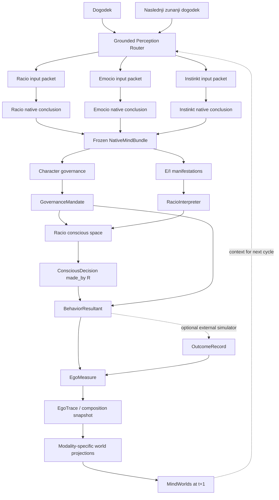

# REI Native Modalities & Ego Composition Architecture

Status: **Accepted for B1; documentation contract, no runtime effect**
Date: 2026-07-13
Canonical language: Slovenian
Supersedes: the active architectural direction in the archived canonical-v2/QLoRA plan

## 1. Purpose and boundary

This document defines the target architecture for the next REI implementation. It is a contract for later phases, not executable code. The legacy package remains unchanged until the new implementation satisfies the cutover gates.

The architecture models three autonomous REI processors with different native modalities, deterministic ordinal character governance, Racio-mediated conscious access, and a computational representation of Ego as a temporal composition of cycles. The Measure/Trace/Snapshot representation is an accepted `implementation_hypothesis`, not a direct-source claim. It does not choose a final provider or model.

The authoritative implementation plan is `plans/REI_native_composition_architecture_upgrade_2026-07-13.md`. Source-backed theory, project synthesis, software operationalization, open questions, metaphysical material, and safety-sensitive boundaries are separately classified in `knowledge/canon_v2/claims.jsonl`.

## 2. Canon authority

Slovenian is the canonical semantic language. English terms and the English normative prose in these architecture documents are operational explanations; `canonical_sl` in the registry remains the semantic authority. A direct-source claim records what a reviewed REI source says; it does not assert independent scientific validation. Project decisions are never attributed to Eros or to an original document.

Claim statuses are:

- `direct_source`: directly supported by a located source;
- `source_synthesis`: conservative synthesis of identified sources;
- `implementation_hypothesis`: a testable software decision;
- `open_question`: deliberately unresolved;
- `deprecated_hypothesis`: retained only as a negative or historical guard.

Claim classes distinguish `theory`, `software_operationalization`, `open_question`, `metaphysical_claim`, and `safety_sensitive_claim`. Core architecture statements below cite their claim IDs; the registry carries the source file, page or section locator, implementation effect, and risk class.

`source_kind` uses `OD` for an original project document, `EK` for Eros commentary, and `IZ` for a project/implementation derivation. `risk_class` uses `core`, `guarded`, `exclude_from_runtime`, or `historical_only`. Claim IDs are stable and unique within this registry. PDF/DOCX sources use the reviewed physical/rendered page; Markdown sources use `source_page: null` plus a mandatory section locator. (`C-CANON-001`)

## 3. Canonical terms

| Slovenian term | Architectural meaning |
| --- | --- |
| Racio | Symbolic-linguistic, numeric, sequential, directly conscious REI processor. |
| Emocio | Visual-scenic, mosaic, comparative, experiential and motor-oriented REI processor. |
| Instinkt | Embodied, interoceptive, associative, protective and homeostatic REI processor. |
| razum | One of the three REI processors; not ordinary reason or an intelligence score. |
| karakter | Stable ordinal allocation of authority among R, E and I. |
| sprejemanje | Directed quality of visibility, translation, tolerance, cooperation and delegation among the minds. |
| resultanta | Observable result of one cycle; not Ego as a whole. |
| `simulated_spoznanje` | Internal convergence of all three modeled processors on the same conclusion; not proof of objective truth. |
| Ego | Source-supported boundary: derived from the three minds, never a fourth mind or decision-maker. This architecture represents it computationally as a temporal composition. |

Full definitions and translation cautions are in `knowledge/canon_v2/glossary.yaml`.

## 4. Non-negotiable invariants

1. Racio, Emocio and Instinkt have distinct native inputs, worlds, memories, processing routes and conclusions; observable behavior alone does not identify the route. (`C-CHAR-002`, `C-ROUTE-001`, `C-NATIVE-001`, `C-NATIVE-002`)
2. In a controlled profile simulation, native processors do not receive the character profile or their rank. (`C-NATIVE-002`)
3. Emocio and Instinkt conclude before manifestation, verbalization or Racio interpretation. (`C-EMOCIO-003`, `C-INSTINKT-003`)
4. A completed `NativeMindBundle` is immutable; later interpretation creates new objects. (`C-BUNDLE-001`)
5. Grounded source evidence, inferred structured scenes and generated imagery remain distinguishable. Generated details never become grounded evidence. (`C-PROV-001`, `C-EMOCIO-004`)
6. Character authority is ordinal and stable. Signal intensity, confidence, stress, mood, keywords and current loudness cannot change structural tiers. (`C-CHAR-003`, `C-CHAR-004`, `C-CHAR-005`)
7. Explicit functional unavailability may alter effective authority, never stored structural character. (`C-STATE-001`, `C-CHAR-006`)
8. A tied leading pair has no automatic subordinate, Racio, confidence or LLM tie-breaker. (`C-PAIR-001`, `C-GOV-002`)
9. `R=E=I` uses two-of-three; only all-three conclusion convergence is `simulated_spoznanje`. (`C-ARB-002`, `C-SPOZ-001`)
10. Every conscious decision is made through Racio, but its native source or governance authority may be E or I. (`C-CONSC-002`, `C-CONSC-003`)
11. `GovernanceMandate`, `ConsciousDecision` and `BehaviorResultant` are separate and may diverge. (`C-GOV-001`, `C-BEHAV-001`)
12. Racio may misunderstand E or I. Diagnostic hidden motives and `TranslationGap` ground truth are not inputs to its interpreter. (`C-CONSC-001`, `C-RACIO-003`)
13. Acceptance is orthogonal to character rank, truth, agreement and safe/small/reversible behavior. (`C-ACCEPT-001`, `C-ACCEPT-002`)
14. Ego has no proposal, vote, preferred option, leading mind or decision API. (`C-EGO-001`, `C-EGO-002`)
15. Ego history is append-only; snapshots are derived and cite supporting measures. (`C-EGO-003`)
16. No hidden LLM may override deterministic governance, and no unbounded agent loop is allowed. (`C-BEHAV-002`, `C-INSTINKT-004`)
17. The implementation is a conceptual REI simulator, not a diagnostic or empirically validated model of a real person. (`C-SAFETY-001`)
18. QLoRA, LoRA, SFT, training datasets and final-model selection are outside this architecture upgrade and implementation scope. (`C-QLORA-001`)

## 5. End-to-end flow



`GovernanceMandate` is not a fourth decision. It records which source mind or minds and option hold structural authority under the tiers; it is not a numerical pressure, confidence score or situational rank override. Racio can interpret that mandate correctly or incorrectly, and actual behavior can align with either, neither, or remain unresolved.

## 6. Grounding and frozen native bundle

`SceneEvent` records raw input, language, evidence, options, actors, constraints and unknowns. Every originally supplied item has provenance. Anything inferred or generated identifies its producer and remains non-grounded unless independently supplied as evidence.

The common B2 contracts are documented as `implementation_hypothesis`:

- `MindId = R | E | I`, `LanguageCode = sl | en`, and `SourceModality = text | image | video | audio | body | smell | taste | simulator`;
- `EvidenceItem(evidence_id, modality, content, grounded, source_ref, confidence, provenance_kind, inferred_by)`;
- `DecisionOption(option_id, label, description)`;
- `SceneEvent(event_id, raw_input, language, evidence, options, actors, constraints, unknowns)`.

Executable B2 models must be strictly typed and reject undeclared fields (`extra="forbid"`). Every artifact object must carry a schema version and stable, traceable ID.

For canonical hashing, conceptual mapping fields from the plan are serialized as ordered tuples of typed key/value entries. Validators reject duplicate keys and enforce domain order (for example R/E/I, body dimensions, attention targets and Emocio valuation dimensions).

The router produces modality-appropriate packets without pre-writing a processor's desire, fear or choice. Each processor uses its own world:

- `RacioWorld`: explicit beliefs, facts, rules, timelines and commitments;
- `EmocioWorld`: visual memories, desired and broken scenes, identity, attraction and motor patterns;
- `InstinktWorld`: associations, trust and threat patterns, attachment, loss and boundaries.

The documented world fields are `RacioWorld(explicit_beliefs, facts, rules, timelines, commitments)`, `EmocioWorld(visual_memories, desired_scenes, broken_scenes, social_identity_motifs, attraction_patterns, motor_patterns)` and `InstinktWorld(associations, trusted_patterns, threat_patterns, attachment_objects, unresolved_losses, boundary_patterns)`.

The three conclusions are frozen into one hashable `NativeMindBundle(bundle_id, scene_id, scene_hash, allowed_option_ids, racio_packet_hash, emocio_packet_hash, instinkt_packet_hash, emocio_visual_state_id/hash, instinkt_body_state_id/hash, instinkt_rollout_hashes, racio, emocio, instinkt, created_at, immutable_hash)`. B2 defines canonical UTF-8 JSON, UTC timestamps, SHA-256 content hashes, stable domain-named IDs and trusted scene/packet/intermediate-artifact validation boundaries. Compact option, packet, visual-state, virtual-body and rollout provenance survives serialization without embedding the complete source objects.

## 7. Native processors and conscious access

### 7.1 Racio

Racio is split by responsibility:

- `RacioNativeProcessor` reaches its own symbolic/linguistic conclusion;
- `RacioInterpreter` infers E/I meaning from manifestations only;
- `RacioCommitter` creates `ConsciousDecision` with `made_by="R"`;
- `RacioNarrator` explains the decision and self-model without mutating decision or behavior.

Direct consciousness does not grant Racio structural priority, an extra vote or privileged truth.

### 7.2 Emocio

Emocio's computational core is a structured visual state tied to one source scene and input packet: current, desired, broken and canonically ordered option-rollout scenes with matching option valuations. It evaluates transformations and reaches a native conclusion before producing a manifestation. A renderer is optional presentation infrastructure, not Emocio itself. Renderer failure, hallucinated detail or absence must not alter the structured conclusion.

Evidence boundary: source review supports Emocio's image-oriented processing and indirect conscious access. Current/desired/broken scene schemas, rollouts, motor dimensions, visual valuation and rendering contracts are software operationalizations with `implementation_hypothesis` status, not direct-source psychology.

### 7.3 Instinkt

Instinkt processes a virtual body state, learned associations, protected targets and option rollouts. Its native result includes danger/loss assessment, boundaries, trust, attachment, scarcity, escape/recoverability and protective action tendency. A Slovene sentence about fear is Racio's interpretation, not Instinkt's literal inner speech.

Evidence boundary: source review supports Instinkt's protective route through danger, loss, trust, attachment and related non-verbal signals. Virtual body, interoception, homeostasis, association memory and option-rollout schemas are software operationalizations. The initial dynamics are one-directional per cycle: body state at `t` conditions processing; action/outcome updates state at `t+1`. These are implementation hypotheses and not medical or physiological claims.

## 8. Character and governance

`CharacterAuthority` stores `authority_tiers: list[list[MindId]]` and one rule: `single_top`, `ordered_top`, `joint_top` or `two_of_three`. The 13 canonical profiles are:

```text
R>(E=I)  E>(R=I)  I>(R=E)
(R=E)>I  (R=I)>E  (E=I)>R
R>E>I    R>I>E    E>R>I    E>I>R    I>R>E    I>E>R
R=E=I
```

Single- and ordered-top profiles give the highest tier governance authority while retaining objections and execution capabilities of lower tiers. For a disagreeing joint-top pair, the initial deterministic policy records the mandate as `unresolved`. A universal pair-resolution rule remains open, and a lower mind is never an automatic tie-breaker. The proposed two-extra-round negotiation cap is an explicit implementation hypothesis, not source doctrine.

`ProcessorAvailability` and a documented functional override can derive `EffectiveAuthority`. They cannot mutate `CharacterAuthority`.

`PairConflict` documents `top_minds`, `option_by_mind`, `status` and `negotiation_rounds`. A person is not reducible to character: the initial person contract contains at least `CharacterAuthority`, `MindDevelopment`, `MindWorlds`, `AcceptanceState`, `CurrentState` and `EgoComposition`. Their exact B2 schemas remain open. (`C-PERSON-001`)

The B3 resolver is a deterministic policy over one already frozen
`NativeMindBundle`; it never calls a processor or provider. A non-null native
`option_id` is the initial cross-modality identity of a conclusion for
governance comparison. It is not an observed action: conscious commitment and
`BehaviorResultant` remain downstream and are never resolver inputs. Three
equal non-null conclusions produce `simulated_spoznanje` for every character
profile, while any abstention makes the spoznanje assessment `unknown` rather
than treating `None` as a vote. This comparison key and the conservative
abstention policy are explicit implementation hypotheses pending a richer
cross-modality conclusion-identity contract.

Functional authority is derived only from an explicit, evidenced
`FunctionalOverride`; availability scores do not imply a threshold. Explicit
delegation preserves structural and effective tiers and may authorize an
operational option without replacing an already resolved mandate or converting
a joint-top disagreement into agreement.
Pair negotiation is limited to two sequential rounds, each with new-information
or new-rollout provenance. Confidence, intensity, mood, stress, keywords,
Racio's consciousness, a subordinate mind, an LLM and fixture expectations are
not tie-breakers.

B3 verification has two non-overlapping layers. The complete ordinal truth
table contains 13 profiles across the five possible equality partitions of
three non-null conclusions (65 cells). Twelve synthetic, governance-only
native-bundle fixtures are each replayed through all 13 profiles without
rerunning processors (156 cells). These fixtures are architectural regression
truth, not training data or claims about real people.

## 9. Acceptance, translation and behavior

Sources support cooperation, tolerance and delegation as aspects of acceptance. The six directed relations and their visibility, translation-fidelity, tolerance, delegation and sabotage dimensions are the initial software model with `implementation_hypothesis` status; they are not asserted as a direct-source psychological schema. Controlled simulations receive this state explicitly, and the first implementation does not infer it from keywords.

Acceptance may improve coordination while minds still disagree. Conversely, outward agreement can coexist with suppression or sabotage. It never assigns rank, proves a goal correct or forces a cautious action.

`TranslationGap` compares frozen E/I conclusions with Racio interpretations for diagnostics. The comparison is visible to the trace/evaluator, not to Racio as ground truth. Any observation introduced only by generated imagery is represented as `renderer_added_ungrounded`; it cannot silently become scene evidence. Initial behavior resolution is a transparent deterministic policy table whose project status is `implementation_hypothesis`.

`BehaviorResultant` documents `option_id`, execution `status`, governance/conscious alignment, operational controller, residual tensions and predicted action. Its statuses are `executed`, `delayed`, `oscillating`, `sabotaged`, `blocked` and `unresolved`.

## 10. Ego as temporal composition

Source-supported boundary: Ego is derived from the three minds and is not a fourth processor or independent decision-maker. For this architecture, Ego is represented computationally through the following accepted software operationalization:

- `EgoMeasure`: one complete cycle, including bundle, governance, interpretation, conscious decision, behavior, outcome and unresolved tensions;
- `EgoTrace`: append-only sequence of measures and correction events;
- `EgoCompositionSnapshot`: derived motifs, conflicts, translation errors, tensions, commitments and `simulated_spoznanja`, each supported by measure IDs;
- modality-specific projections: chronology/facts to R, scenes/motifs to E, body/association patterns to I.

An optional reflector may propose sourced hypotheses about the trace. It cannot change the current native bundle, governance mandate, conscious decision or behavior. “Življenje” remains outside the executable model and must not become an agent.

## 11. Execution modes

`controlled_profile_matrix` reuses the same `SceneEvent`, three worlds and frozen native bundle across all 13 profiles without rerunning processors. It isolates the effect of ordinal governance.

`person_longitudinal` keeps structural character stable while each outcome updates worlds and history. Later native conclusions may therefore differ. Character rank still is not passed directly to a native processor.

## 12. Provider and artifact boundary

Later implementations remain provider-independent. The documented protocol boundaries are `TextReasoner`, `VisionLanguageInterpreter`, `ImageRenderer`, `ImageEncoder`, `VisualWorldModel`, `BodyDynamicsModel`, `ArtifactStore` and `EgoTraceStore`.

Required deterministic/fake/store adapters are `DeterministicRacioProvider`, `DeterministicEmocioProvider`, `DeterministicInstinktProvider`, `NullImageRenderer`, `FakeVisionLanguageInterpreter`, `InMemoryEgoTraceStore` and `FileArtifactStore`. They are B2+ implementation work, not files to create in B1.

Every artifact carries a schema version and stable domain ID. B2 provider call specs record implementation identity/revision, model provenance when applicable, seed, canonically ordered parameters and timeout. Each call explicitly selects a compatible fallback provider or records why no fallback exists; execution records bind back to the immutable spec hash, preserve primary completion time and status, and represent successful, unsuccessful or explicitly skipped fallback outcomes without publishing outputs from failed attempts. A planned fallback after primary failure cannot disappear without an outcome or skip reason. Provider result artifacts require a successful final outcome and the matching capability kind; one immutable artifact ID cannot be both input and output of the same call. A run manifest separately records source commit, canon version, profile, acceptance configuration, provider identities, call specs/records, seeds, native hashes, their explicit `produced | inherited` source, deterministic bundle-assembly provenance, timing, warnings and safety flags. Each assembled native conclusion has exactly one successful provider producer completed before assembly starts; only assembly produces the final bundle. Inherited native hashes require an exact parent manifest ID/hash, external four-hash comparison and a parent completion time no later than the child start.

The target run tree separates `scene/`, `native/`, `emocio/`, `instinkt/`, `communication/`, `governance/`, `conscious/`, `behavior/`, `ego/` and `diagnostics/` under `output/runs/{run_id}/`. Artifact-store, image and mask paths are canonical portable paths relative to that run root; absolute, traversal, dot, backslash, control-character, trailing-dot/space and reserved-device paths are rejected. `run_manifest.json` is the provenance root; no generated artifact silently replaces its grounded source.

```text
output/runs/{run_id}/
├── run_manifest.json
├── scene/
│   ├── event.json
│   ├── racio_packet.json
│   ├── emocio_packet.json
│   └── instinkt_packet.json
├── native/
│   ├── bundle.json
│   ├── racio.json
│   ├── emocio.json
│   └── instinkt.json
├── emocio/
│   ├── visual_state.json
│   ├── scenes/
│   └── images/
├── instinkt/
│   ├── body_before.json
│   ├── option_rollouts.json
│   └── body_after.json
├── communication/
│   ├── manifestations.json
│   ├── interpretations.json
│   └── translation_gaps.json
├── governance/
│   ├── character.json
│   ├── mandate.json
│   └── delegation.json
├── conscious/
│   ├── decision.json
│   └── narrative.json
├── behavior/
│   └── resultant.json
├── ego/
│   ├── measure.json
│   └── composition_snapshot.json
└── diagnostics/
    ├── invariants.json
    └── report.md
```

B1 performs no provider or model selection. Therefore no technology/model freshness decision is made in this phase.

## 13. Explicit exclusions

The following are prohibited in this architecture:

- decimal profile weights, weighted-compromise governance or situational rank bonuses;
- keyword-based acceptance or benchmark-specific behavioral patches;
- a shared text prompt as the native implementation of all three minds;
- deriving E/I conclusions retroactively from Racio's description;
- generated image content promoted to grounded evidence;
- subordinate, confidence-based, Racio or LLM tie-breakers for joint-top conflict;
- Ego as agent, voter, preferred option, leading mind or decision-maker;
- psychological diagnosis, real-person character assignment or medical claims;
- `LifeAgent`, unbounded loops, QLoRA/LoRA/SFT, training datasets or final-model selection.

## 14. B1 phase boundary and open contracts

B1 freezes semantics only. Executable Pydantic models, protocols, hashing, persistence and tests belong to B2 or later. Open items include canonical serialization/hash formats, ID/timestamp formats, exact availability thresholds, bounded negotiation details, Racio input schema, some projection/reflection schemas, safety-caveat propagation and empirical evaluation of translation fidelity.

The complete registry is `knowledge/canon_v2/open_questions.md`. No unresolved item may be silently implemented as fact.

## 15. Decision and claim map

| Decision record | Primary claim families |
| --- | --- |
| ADR-001 Native modalities | `C-NATIVE-*`, `C-PROV-001`, `C-BUNDLE-001`, `C-EMOCIO-*`, `C-INSTINKT-*` |
| ADR-002 Racio conscious decision | `C-PERCEPT-001`, `C-CONSC-*`, `C-RACIO-003` |
| ADR-003 Ordinal governance | `C-CHAR-*`, `C-ARB-*`, `C-PAIR-001`, `C-GOV-*`, `C-PERSON-001` |
| ADR-004 Ego as composition | `C-WORLD-001`, `C-RESULT-001`, `C-EGO-*`, `C-LIFE-001` |
| ADR-005 Acceptance is orthogonal | `C-ACCEPT-*`, `C-DELEG-001`, `C-BEHAV-*` |

The ADRs are normative architecture decisions. The claim registry remains the traceability source for why each decision is direct-source, synthesis, hypothesis, open, deprecated, metaphysical or safety-sensitive.
