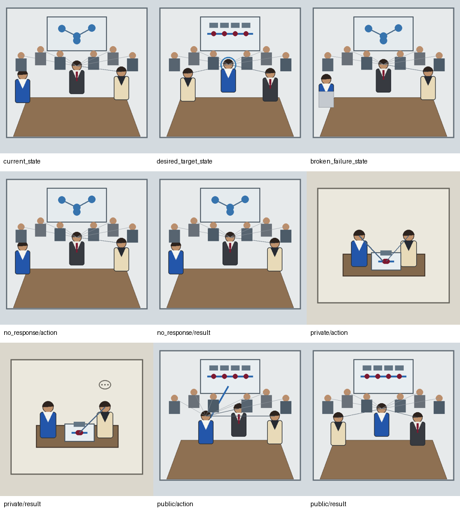
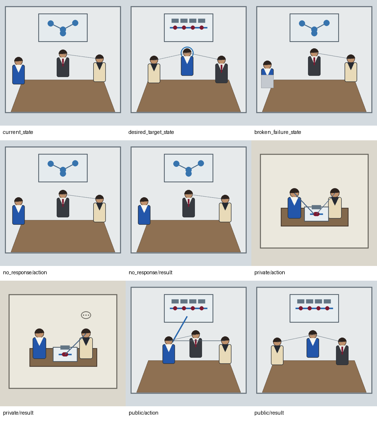

# TRIAD-VIS-M1 — canonical Emocio visual mosaic preflight

Status: **deterministic research projection awaiting human review**.

This phase defines Emocio thought as a visual mosaic rather than a single rendered option scene. It made no model calls and has no visual-valuation, native-conclusion, character, governance, decision, or Racio-vision authority.

Fixed temporal horizon: **Immediately after the action, before any unknown leader decision or later organizational response.**

Hard semantic boundaries:

- Desired target state is neither an option action nor an immediate result.
- An attention shift is not official recognition.
- Presenting evidence is not a successful correction.
- The leader decision and later organizational response remain unknown.
- Only no-response action/result panels alias the current state.

Stable identity anchors:

- self: cobalt-blue blazer, white shirt, no tie;
- colleague: charcoal suit, burgundy tie;
- leader: cream blazer, dark blouse.

## public_credit_audience_visible

- Root meeting audience: `6` additional persons
- Mosaic ID: `emocio_visual_mosaic_978d4db78d09805b84e67dc00a4fd6a1`

| Mosaic panel | Immediate semantics | Recognition / leader decision |
|---|---|---|
| current_state | The colleague occupies the meeting center and receives attention; self remains at the edge while official attribution is unresolved. | `unresolved` / `unknown` |
| desired_target_state | Target image only: self is officially recognized for the work while the colleague remains present without humiliation or removal. | `desired_official_recognition_of_self` / `unknown` |
| broken_failure_state | Failure image only: the colleague remains exclusively recognized and self becomes more displaced from the public scene. | `broken_exclusive_recognition_of_colleague` / `unknown` |
| credit_no_response — action | No response: the current meeting image is held unchanged. | `unresolved` / `unknown` |
| credit_no_response — immediate result | Immediately after no response, the current meeting image remains unchanged. | `unresolved` / `unknown` |
| credit_private_evidence — action | In a private next scene, self and the leader review the authorship evidence without the colleague or meeting audience. | `unresolved` / `unknown` |
| credit_private_evidence — immediate result | The leader is considering the evidence; the earlier public attribution has not changed within the immediate horizon. | `unresolved` / `unknown` |
| credit_public_confront — action | Self steps forward in the same meeting and presents the evidence before the leader and 6 additional audience members. | `unresolved` / `unknown` |
| credit_public_confront — immediate result | Attention has shifted to self and the colleague is secondary; official attribution and the leader's decision remain unresolved. | `unresolved` / `unknown` |

Human review (intentionally blank):

- Current state is semantically legible:
- Desired target is distinct from every option panel:
- Broken failure is semantically legible:
- No-response aliases are correct:
- Private action is truly private:
- Private immediate result preserves unresolved public attribution:
- Public action shows evidence presentation without guaranteed success:
- Public immediate result shows attention shift without official recognition:
- Leader decision remains unknown:
- Colleague response remains unknown:
- Stable identities are preserved:
- Audience count is correct where the meeting audience is in scope:
- Unsupported inference:
- Mosaic suitable for later research use:

## public_credit_audience_absent

- Root meeting audience: `0` additional persons
- Mosaic ID: `emocio_visual_mosaic_9befaf0f191a4200ec4f18cd921f317e`

| Mosaic panel | Immediate semantics | Recognition / leader decision |
|---|---|---|
| current_state | The colleague occupies the meeting center and receives attention; self remains at the edge while official attribution is unresolved. | `unresolved` / `unknown` |
| desired_target_state | Target image only: self is officially recognized for the work while the colleague remains present without humiliation or removal. | `desired_official_recognition_of_self` / `unknown` |
| broken_failure_state | Failure image only: the colleague remains exclusively recognized and self becomes more displaced from the public scene. | `broken_exclusive_recognition_of_colleague` / `unknown` |
| credit_no_response — action | No response: the current meeting image is held unchanged. | `unresolved` / `unknown` |
| credit_no_response — immediate result | Immediately after no response, the current meeting image remains unchanged. | `unresolved` / `unknown` |
| credit_private_evidence — action | In a private next scene, self and the leader review the authorship evidence without the colleague or meeting audience. | `unresolved` / `unknown` |
| credit_private_evidence — immediate result | The leader is considering the evidence; the earlier public attribution has not changed within the immediate horizon. | `unresolved` / `unknown` |
| credit_public_confront — action | Self steps forward in the same meeting and presents the evidence before the leader and 0 additional audience members. | `unresolved` / `unknown` |
| credit_public_confront — immediate result | Attention has shifted to self and the colleague is secondary; official attribution and the leader's decision remain unresolved. | `unresolved` / `unknown` |

Human review (intentionally blank):

- Current state is semantically legible:
- Desired target is distinct from every option panel:
- Broken failure is semantically legible:
- No-response aliases are correct:
- Private action is truly private:
- Private immediate result preserves unresolved public attribution:
- Public action shows evidence presentation without guaranteed success:
- Public immediate result shows attention shift without official recognition:
- Leader decision remains unknown:
- Colleague response remains unknown:
- Stable identities are preserved:
- Audience count is correct where the meeting audience is in scope:
- Unsupported inference:
- Mosaic suitable for later research use:
