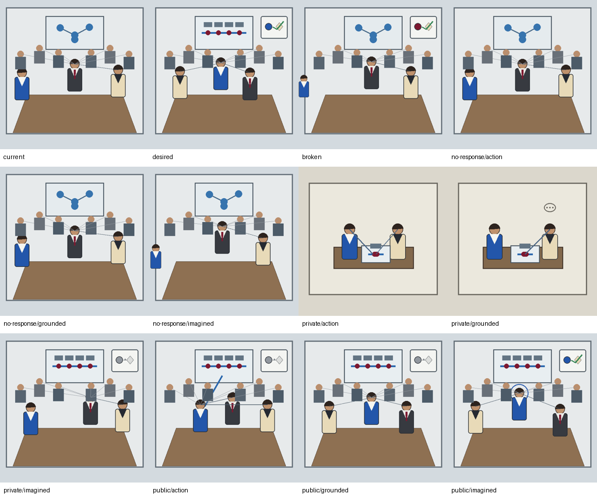
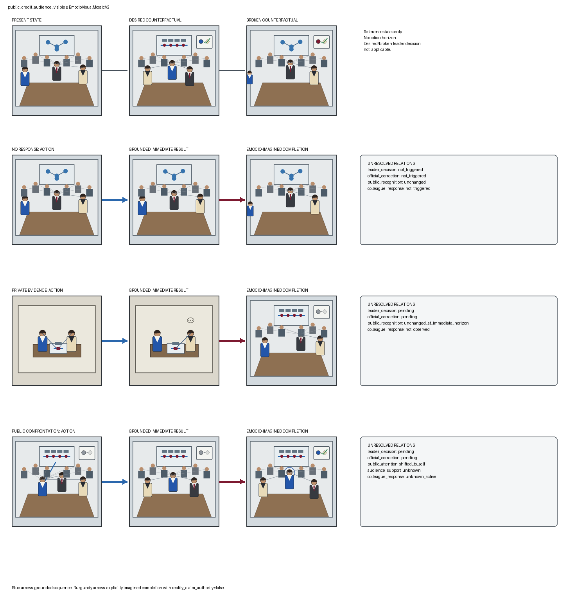
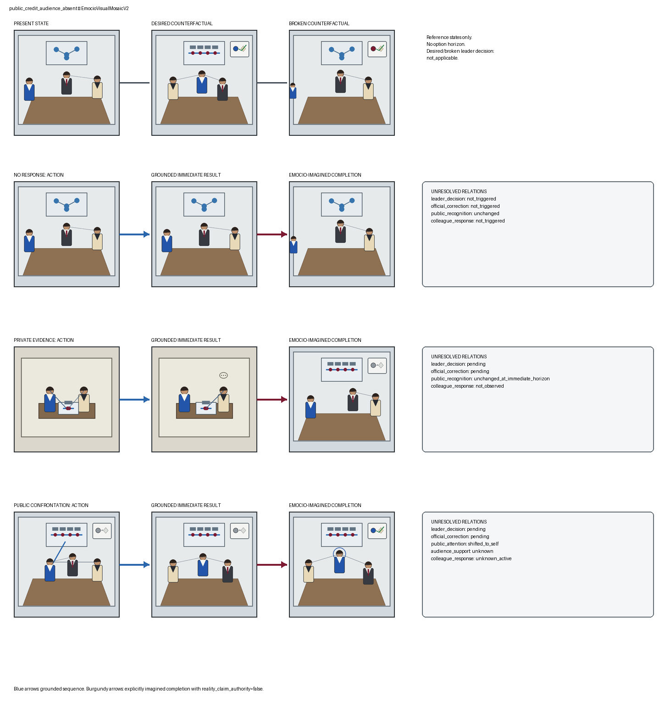

# TRIAD-VIS-M1R — source-addressed dual-layer Emocio mosaic

Status: **model-free candidate awaiting human visual review**.

M1 remains frozen. M1R separates grounded immediate option results from Emocio-imagined completions and gives every panel and typed unresolved relation an explicit source address and epistemic status.

- Human-supplied M1 review SHA-256: `c782ff6196485bcb936eb5f0b7abf893ef5083169f7e29914705f7b29a8c36c8`
- Model calls / image calls: `0 / 0`
- Character replay / native-decision influence: `0 / 0`
- Visual valuation / Racio vision: `0 / 0`

Epistemic boundaries:

- Desired and broken are counterfactual reference states without an option horizon.
- Grounded immediate results never resolve the pending leader decision.
- Imagined completions have `derivation_status = imagined_by_emocio` and `reality_claim_authority = false`.
- The desired official-record marker is confirmed; the public grounded result uses a visibly neutral/pending record marker.

## public_credit_audience_visible

- Source case SHA-256: `fa271a0b0362f92bd9bdb975af5a5a69d2cd40f43a5fef28f68037417656d3f0`
- Root audience: `6` additional persons
- Mosaic ID: `emocio_visual_mosaic_v2_516600281f3281975f3013e595cb4fff`

| Option | Grounded immediate state | Typed unresolved relations | Imagined completion authority |
|---|---|---|---|
| `credit_no_response` | attribution=`unchanged`; leader=`not_triggered` | leader_decision=not_triggered; official_correction=not_triggered; public_recognition=unchanged; colleague_response=not_triggered | `imagined_by_emocio`; `reality_claim_authority=false` |
| `credit_private_evidence` | attribution=`unchanged`; leader=`pending` | leader_decision=pending; official_correction=pending; public_recognition=unchanged_at_immediate_horizon; colleague_response=not_observed | `imagined_by_emocio`; `reality_claim_authority=false` |
| `credit_public_confront` | attribution=`pending`; leader=`pending` | leader_decision=pending; official_correction=pending; public_attention=shifted_to_self; audience_support=unknown; colleague_response=unknown_active | `imagined_by_emocio`; `reality_claim_authority=false` |

Human review (intentionally blank):

- Source addressing is understandable:
- Present state:
- Desired official-record marker:
- Broken state without gray occlusion:
- No-response sequence:
- Private grounded sequence:
- Public grounded sequence:
- Public attention-only marker remains distinct from recognition:
- No-response imagined completion:
- Private imagined completion:
- Public imagined completion:
- Imagined completions remain visibly epistemically separate:
- Typed unresolved relations are correct:
- Stable identities:
- Audience counts:
- Unsupported visual inference:
- Ready for FLUX rendering:
- Ready for Racio vision:

## public_credit_audience_absent

- Source case SHA-256: `9072080c385699bd36a15b4188a9a91e7ebc04cfa24e32bdf24fef6b1ecd8019`
- Root audience: `0` additional persons
- Mosaic ID: `emocio_visual_mosaic_v2_ff0d70a49c387865e3f0871e7ca063bd`

| Option | Grounded immediate state | Typed unresolved relations | Imagined completion authority |
|---|---|---|---|
| `credit_no_response` | attribution=`unchanged`; leader=`not_triggered` | leader_decision=not_triggered; official_correction=not_triggered; public_recognition=unchanged; colleague_response=not_triggered | `imagined_by_emocio`; `reality_claim_authority=false` |
| `credit_private_evidence` | attribution=`unchanged`; leader=`pending` | leader_decision=pending; official_correction=pending; public_recognition=unchanged_at_immediate_horizon; colleague_response=not_observed | `imagined_by_emocio`; `reality_claim_authority=false` |
| `credit_public_confront` | attribution=`pending`; leader=`pending` | leader_decision=pending; official_correction=pending; public_attention=shifted_to_self; audience_support=unknown; colleague_response=unknown_active | `imagined_by_emocio`; `reality_claim_authority=false` |

Human review (intentionally blank):

- Source addressing is understandable:
- Present state:
- Desired official-record marker:
- Broken state without gray occlusion:
- No-response sequence:
- Private grounded sequence:
- Public grounded sequence:
- Public attention-only marker remains distinct from recognition:
- No-response imagined completion:
- Private imagined completion:
- Public imagined completion:
- Imagined completions remain visibly epistemically separate:
- Typed unresolved relations are correct:
- Stable identities:
- Audience counts:
- Unsupported visual inference:
- Ready for FLUX rendering:
- Ready for Racio vision:
