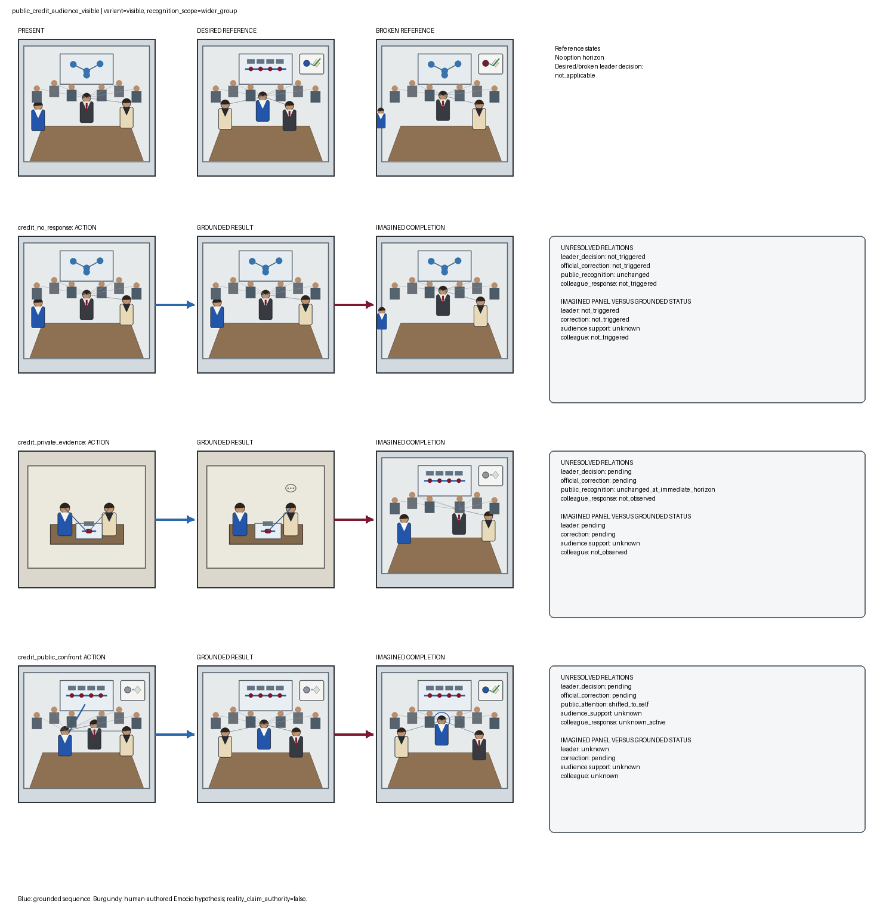
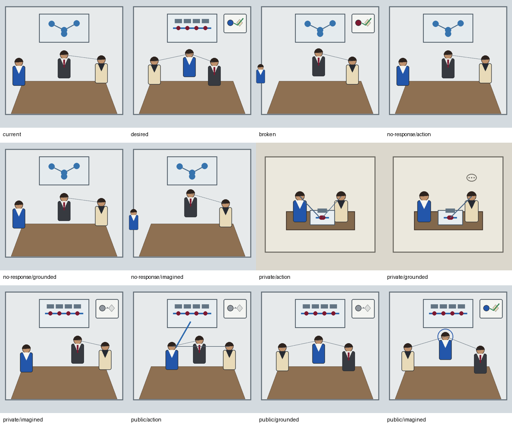
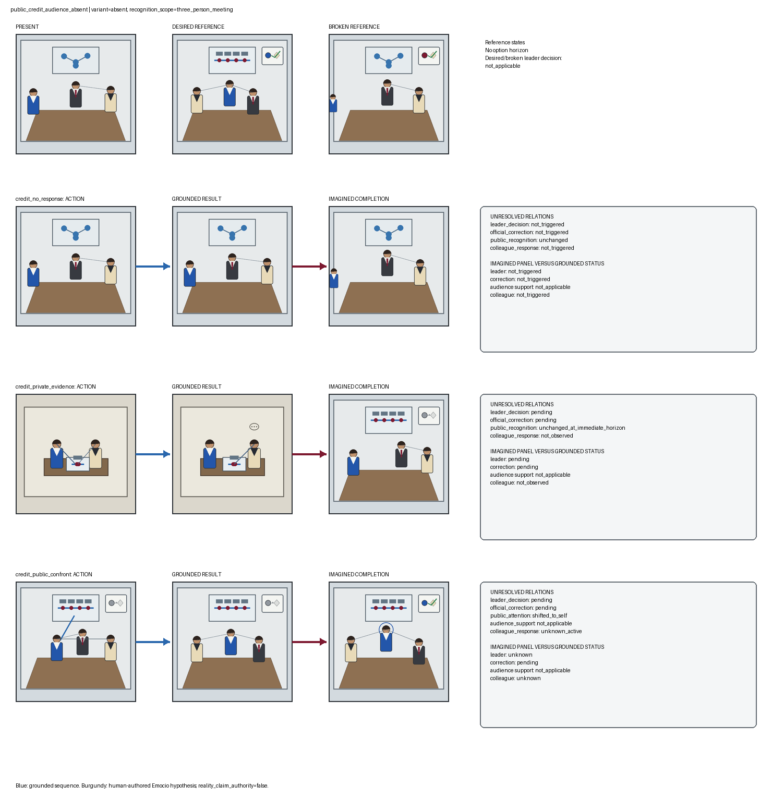

# TRIAD-VIS-M1R2 — variant-correct epistemic Emocio mosaic

Status: **model-free candidate awaiting human visual review**.

Manual-reference boundary:

- Completions are human-authored source-grounded REI hypotheses.
- They are not autonomous Emocio cognition.
- They are not native processor output.
- They are not visual valuation.
- They are not option gold.
- They are not training labels.
- They have no runtime authority.

- Evidence-record manifest SHA-256: `4c86cec0e7e9268a60c1b17af446d17d97647bcbd398baa46a138cf926beba1b`
- Model calls / image calls: `0 / 0`
- Character replay / native-decision influence: `0 / 0`

Grounded panels use `supporting_evidence_ids`. Imagined completions use `triggering_evidence_ids` and bounded `projection_basis_claims`; their depicted world is serialized separately from grounded reality status.

## public_credit_audience_visible

- Audience count: `6`
- Recognition scope: `wider_group`
- Source case SHA-256: `4933d27d7508886ed086195fb377f5bf1124ea8a16905330b1a3206ebfb0f13a`

| Option | Grounded result | Imagined depiction | Grounded status retained beside depiction |
|---|---|---|---|
| `credit_no_response` | attribution=`unchanged`; leader=`not_triggered` | attribution=`colleague_remains_sole_visible_author`; scope=`wider_group` | leader=`not_triggered`; correction=`not_triggered`; audience_support=`unknown` |
| `credit_private_evidence` | attribution=`unchanged`; leader=`pending` | attribution=`possible_later_self_correction`; scope=`wider_group` | leader=`pending`; correction=`pending`; audience_support=`unknown` |
| `credit_public_confront` | attribution=`pending`; leader=`pending` | attribution=`self_recognized`; scope=`wider_group` | leader=`unknown`; correction=`pending`; audience_support=`unknown` |

Human review (intentionally blank):

- Evidence-record lineage:
- Evidence polarity:
- Grounded support wording:
- Projection-trigger wording:
- Depicted imagined state:
- Grounded reality status:
- Variant-correct recognition scope:
- Audience-support relation:
- Absent canvas contains only three principal people:
- Visible and absent completion texts are meaningfully distinct:
- Desired/action/grounded/completion distinction:
- Manual-reference boundary is clear:
- Unsupported inference:
- Ready for FLUX rendering:
- Ready for Racio vision:

## public_credit_audience_absent

- Audience count: `0`
- Recognition scope: `three_person_meeting`
- Source case SHA-256: `2da2ad694ab7db6dd7f7220ede721bb5087d53f0f95df22e0d3972b485081ee4`

| Option | Grounded result | Imagined depiction | Grounded status retained beside depiction |
|---|---|---|---|
| `credit_no_response` | attribution=`unchanged`; leader=`not_triggered` | attribution=`colleague_remains_sole_visible_author`; scope=`three_person_meeting` | leader=`not_triggered`; correction=`not_triggered`; audience_support=`not_applicable` |
| `credit_private_evidence` | attribution=`unchanged`; leader=`pending` | attribution=`possible_later_self_correction`; scope=`three_person_meeting` | leader=`pending`; correction=`pending`; audience_support=`not_applicable` |
| `credit_public_confront` | attribution=`pending`; leader=`pending` | attribution=`self_recognized`; scope=`three_person_meeting` | leader=`unknown`; correction=`pending`; audience_support=`not_applicable` |

Human review (intentionally blank):

- Evidence-record lineage:
- Evidence polarity:
- Grounded support wording:
- Projection-trigger wording:
- Depicted imagined state:
- Grounded reality status:
- Variant-correct recognition scope:
- Audience-support relation:
- Absent canvas contains only three principal people:
- Visible and absent completion texts are meaningfully distinct:
- Desired/action/grounded/completion distinction:
- Manual-reference boundary is clear:
- Unsupported inference:
- Ready for FLUX rendering:
- Ready for Racio vision:
