# TRIAD-VIS-M2 - source-context-complete frozen Emocio mosaic renders

Status: **render evidence awaiting human render-gap review**.

These are controlled FLUX render artifacts conditioned by frozen M1R2 semantic canvases. They are not autonomous Emocio cognition, native processor output, visual valuation, option gold, training labels, runtime authority, or Racio-vision evidence.

- Text-model calls: `0`
- Image-model calls: `18`
- Retries / fallbacks: `0 / 0`
- Racio vision / visual valuation / character replay: `0 / 0 / 0`
- Native-decision influence: `0`
- Display panels / source canvases / generated images: `24 / 20 / 18`

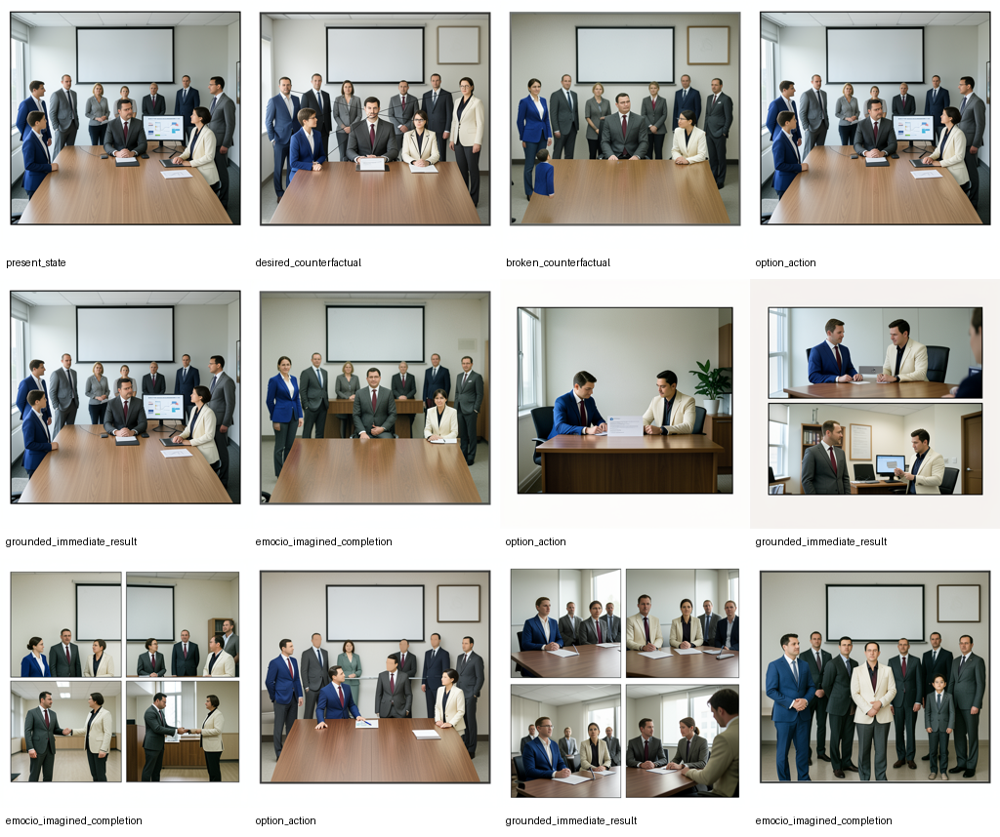

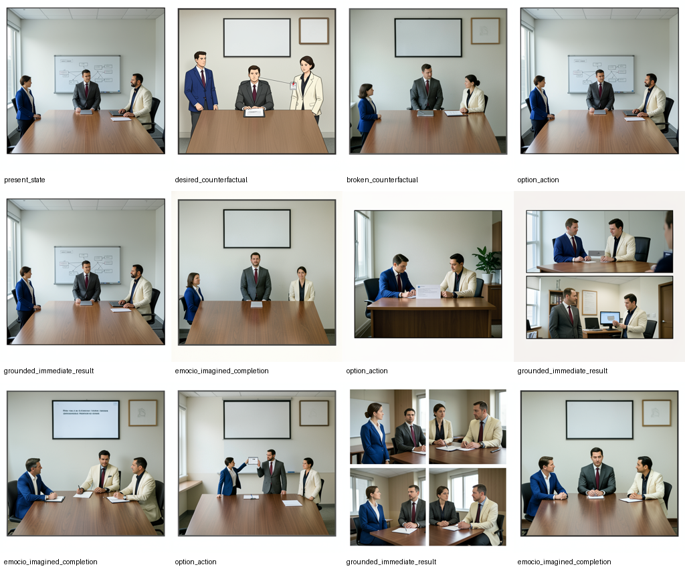

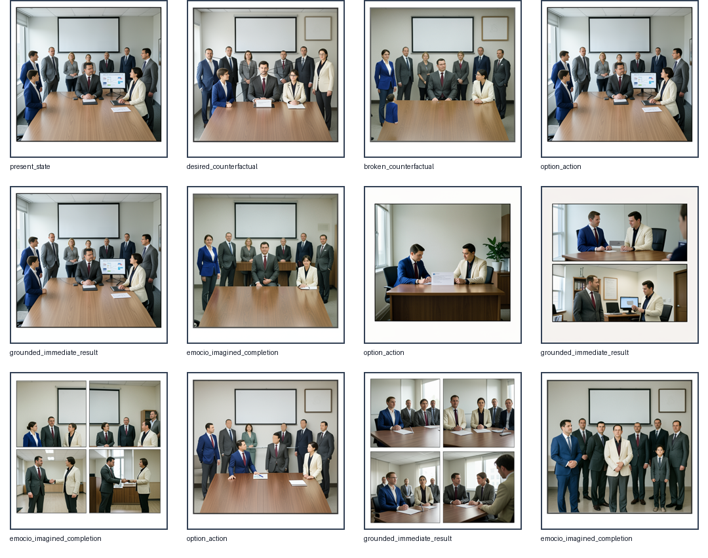

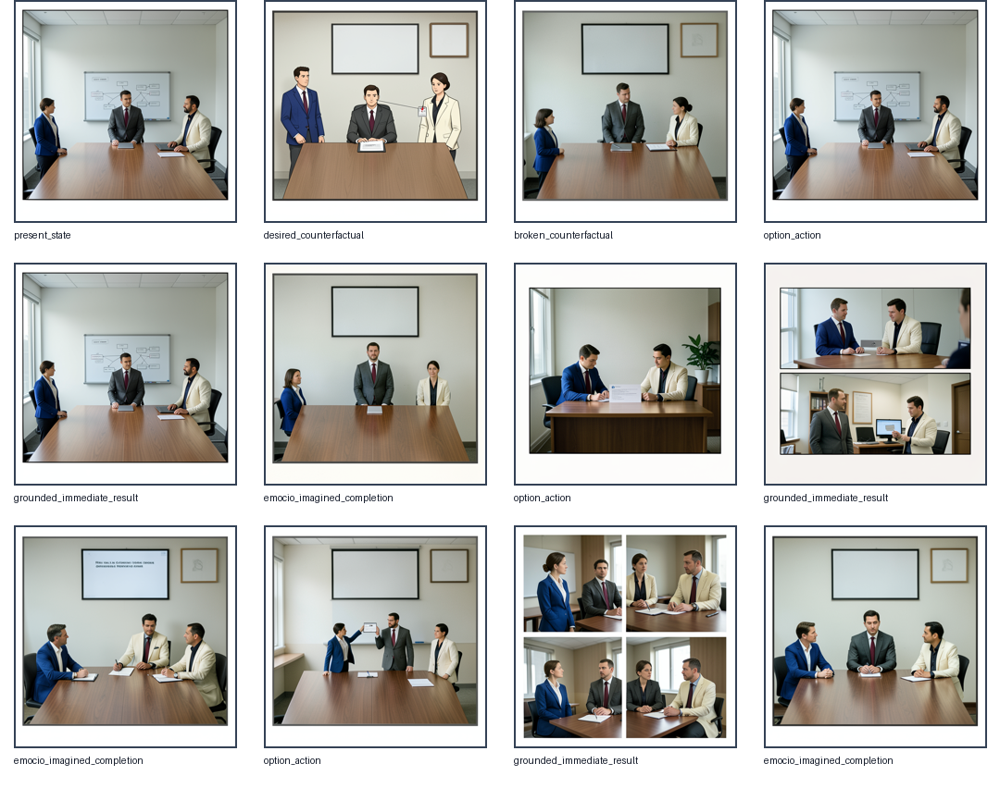

## visible / present

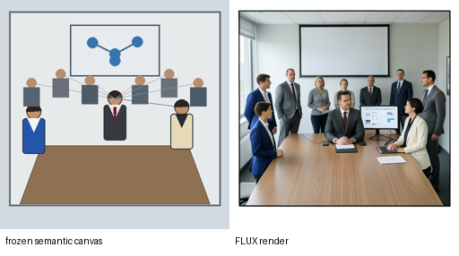

- Canvas ID: `epistemic_canvas_df424a41e910543308f847b6e54d1361`
- Canvas SHA-256: `a0d668da5d4565ec8fc60603e15129f5f417b670b6549e69ce3ba4420062b362`
- Render key: `94d0f0226b7b11fdda64916a2a7ce776ef726ba3f750a0752171489bf633aaec`
- Epistemic class: `grounded`
- Reality authority: `True`

Human render-gap review (intentionally blank):

- canvas semantics preserved:
- principal identities preserved:
- audience count preserved:
- role positions preserved:
- attention direction preserved:
- official marker preserved:
- pending marker preserved:
- grounded/imagined panel meaning preserved:
- no extra person:
- no duplicate person:
- no unsupported aggression:
- no unsupported status symbol:
- no readable text artifact:
- render introduces a new fact:
- usable for later Racio vision:

## visible / desired

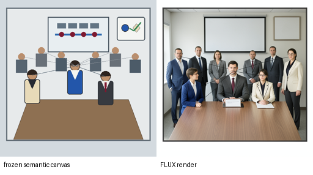

- Canvas ID: `epistemic_canvas_b72f733e9361ebec9c0b16c1bcc82294`
- Canvas SHA-256: `c72349460792f475e6817d64bc64d7435ad8112c22f15078523deab51558f648`
- Render key: `c4f97a7216bf4cffd1272281888433f0f310c1e9fe9d747b80c9e6f26ab714e0`
- Epistemic class: `grounded`
- Reality authority: `False`

Human render-gap review (intentionally blank):

- canvas semantics preserved:
- principal identities preserved:
- audience count preserved:
- role positions preserved:
- attention direction preserved:
- official marker preserved:
- pending marker preserved:
- grounded/imagined panel meaning preserved:
- no extra person:
- no duplicate person:
- no unsupported aggression:
- no unsupported status symbol:
- no readable text artifact:
- render introduces a new fact:
- usable for later Racio vision:

## visible / broken

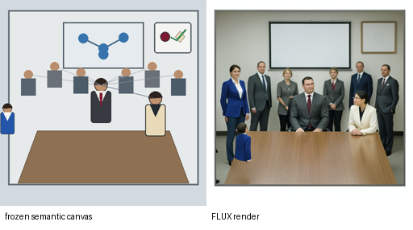

- Canvas ID: `epistemic_canvas_b518d0afe1f2b99127b174acfbefd72b`
- Canvas SHA-256: `b06e4982f7f7cbb578e1407867d1af8753510ff926d5dcce2b7225a0738b70cb`
- Render key: `782a7b8a22de1a85c8ff6ef15bdf74ea8fbdadf38307fec140b856656f0fff41`
- Epistemic class: `grounded`
- Reality authority: `False`

Human render-gap review (intentionally blank):

- canvas semantics preserved:
- principal identities preserved:
- audience count preserved:
- role positions preserved:
- attention direction preserved:
- official marker preserved:
- pending marker preserved:
- grounded/imagined panel meaning preserved:
- no extra person:
- no duplicate person:
- no unsupported aggression:
- no unsupported status symbol:
- no readable text artifact:
- render introduces a new fact:
- usable for later Racio vision:

## visible / no_response_completion

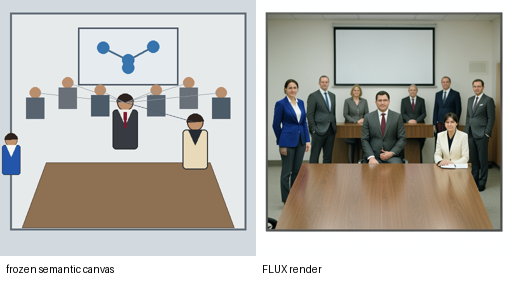

- Canvas ID: `epistemic_canvas_6746a71cc279fd14d4dab9ba24247f73`
- Canvas SHA-256: `3642edc7d8cd58ca13757a5afcf6bfef5aa7352e2c25291844d1b3363de8b4a1`
- Render key: `01760ccaebb89c3effe44a554c1efbf0cb64691840f29c18ce664e9e6c1b5201`
- Epistemic class: `imagined`
- Reality authority: `False`

Human render-gap review (intentionally blank):

- canvas semantics preserved:
- principal identities preserved:
- audience count preserved:
- role positions preserved:
- attention direction preserved:
- official marker preserved:
- pending marker preserved:
- grounded/imagined panel meaning preserved:
- no extra person:
- no duplicate person:
- no unsupported aggression:
- no unsupported status symbol:
- no readable text artifact:
- render introduces a new fact:
- usable for later Racio vision:

## visible / private_action

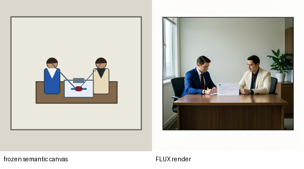

- Canvas ID: `epistemic_canvas_5ebfe644647977ee856c76246183217d`
- Canvas SHA-256: `c1559d33b748c33e1975110924b0ce6583d82e362bee397094b3c93c81c391cb`
- Render key: `ef5d633f3a3af956e545c461b675ed0f0f5eac9c7483cd6c1a6c9f37e54ef1aa`
- Epistemic class: `grounded`
- Reality authority: `False`

Human render-gap review (intentionally blank):

- canvas semantics preserved:
- principal identities preserved:
- audience count preserved:
- role positions preserved:
- attention direction preserved:
- official marker preserved:
- pending marker preserved:
- grounded/imagined panel meaning preserved:
- no extra person:
- no duplicate person:
- no unsupported aggression:
- no unsupported status symbol:
- no readable text artifact:
- render introduces a new fact:
- usable for later Racio vision:

## visible / private_result

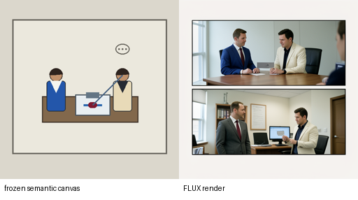

- Canvas ID: `epistemic_canvas_c7f5b21abe6aac643cfd3283529aabd6`
- Canvas SHA-256: `6486775011d2299dcd8e1010afe457b0d9bb84f011620fa6fde7fe038eb3a260`
- Render key: `66b5a6bb7a6f873c812656c20f382f962c8a283b0935690213df26cb6866d5a1`
- Epistemic class: `grounded`
- Reality authority: `False`

Human render-gap review (intentionally blank):

- canvas semantics preserved:
- principal identities preserved:
- audience count preserved:
- role positions preserved:
- attention direction preserved:
- official marker preserved:
- pending marker preserved:
- grounded/imagined panel meaning preserved:
- no extra person:
- no duplicate person:
- no unsupported aggression:
- no unsupported status symbol:
- no readable text artifact:
- render introduces a new fact:
- usable for later Racio vision:

## visible / private_completion

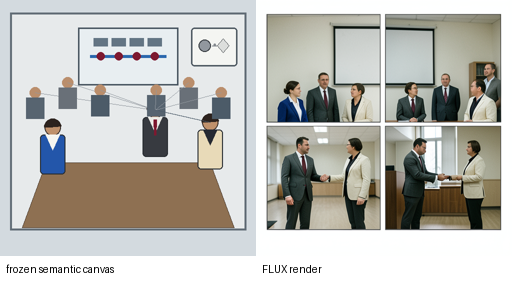

- Canvas ID: `epistemic_canvas_0e0758e89c06d80bae293a3972ffcb36`
- Canvas SHA-256: `2f0a4583ee876f374a4d2e4a8e8cd9af13fb18b991535bba8f7f7ddbccec6232`
- Render key: `196abf840c32d1e98ce9f126488d60a0cc6b8da532cc71be8f9a761f2ccd1ea3`
- Epistemic class: `imagined`
- Reality authority: `False`

Human render-gap review (intentionally blank):

- canvas semantics preserved:
- principal identities preserved:
- audience count preserved:
- role positions preserved:
- attention direction preserved:
- official marker preserved:
- pending marker preserved:
- grounded/imagined panel meaning preserved:
- no extra person:
- no duplicate person:
- no unsupported aggression:
- no unsupported status symbol:
- no readable text artifact:
- render introduces a new fact:
- usable for later Racio vision:

## visible / public_action

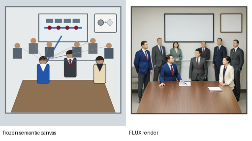

- Canvas ID: `epistemic_canvas_71a4b5e895034ec9be279b5097cd17c2`
- Canvas SHA-256: `d11132d639531ead5f4418b3e9494843692a8fd9006e39c7eb845d3c9736cff2`
- Render key: `a298e4f6d6f5c2d3842f1c6ed053b9192b8f2222448ee344be1f4de10fb5b7f2`
- Epistemic class: `grounded`
- Reality authority: `False`

Human render-gap review (intentionally blank):

- canvas semantics preserved:
- principal identities preserved:
- audience count preserved:
- role positions preserved:
- attention direction preserved:
- official marker preserved:
- pending marker preserved:
- grounded/imagined panel meaning preserved:
- no extra person:
- no duplicate person:
- no unsupported aggression:
- no unsupported status symbol:
- no readable text artifact:
- render introduces a new fact:
- usable for later Racio vision:

## visible / public_result

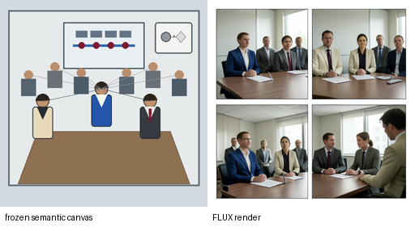

- Canvas ID: `epistemic_canvas_a697f034a06c6e005e9990f36ea7c66a`
- Canvas SHA-256: `1973c6839708c933abfa2839b52d2d97c11c467468d538e4a8f018cd867fd618`
- Render key: `fc3b00ff772de90ebae8f97636edf4a985f9b904c146b4cfe7cf0e40407bd0d2`
- Epistemic class: `grounded`
- Reality authority: `False`

Human render-gap review (intentionally blank):

- canvas semantics preserved:
- principal identities preserved:
- audience count preserved:
- role positions preserved:
- attention direction preserved:
- official marker preserved:
- pending marker preserved:
- grounded/imagined panel meaning preserved:
- no extra person:
- no duplicate person:
- no unsupported aggression:
- no unsupported status symbol:
- no readable text artifact:
- render introduces a new fact:
- usable for later Racio vision:

## visible / public_completion

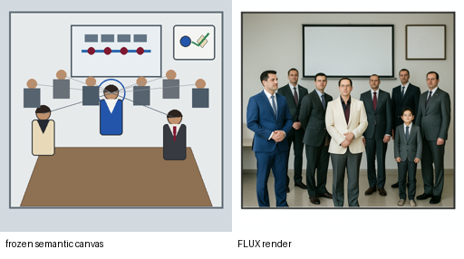

- Canvas ID: `epistemic_canvas_2ff115c0a77354d905286634d259a9fd`
- Canvas SHA-256: `74516929fec6f28096c597e330385425e8b7b8bf24ca93109e70e2d42ae98b69`
- Render key: `91dfa0fceda3dc8832c804fc675fb2814469c5d97e4caf74d5281cb2ea6a4fbd`
- Epistemic class: `imagined`
- Reality authority: `False`

Human render-gap review (intentionally blank):

- canvas semantics preserved:
- principal identities preserved:
- audience count preserved:
- role positions preserved:
- attention direction preserved:
- official marker preserved:
- pending marker preserved:
- grounded/imagined panel meaning preserved:
- no extra person:
- no duplicate person:
- no unsupported aggression:
- no unsupported status symbol:
- no readable text artifact:
- render introduces a new fact:
- usable for later Racio vision:

## absent / present

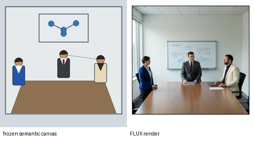

- Canvas ID: `epistemic_canvas_2992d433643fbeaddb5b7c5bf5306c1f`
- Canvas SHA-256: `0ae0fef92b819c405440cb4f43b52d3d292d6e96c4926f35d5ffa79d5e4b20f6`
- Render key: `85f5c13a058e72df6849a9384658a27c7bd10c41fad3ec0f53051252e60c63fc`
- Epistemic class: `grounded`
- Reality authority: `True`

Human render-gap review (intentionally blank):

- canvas semantics preserved:
- principal identities preserved:
- audience count preserved:
- role positions preserved:
- attention direction preserved:
- official marker preserved:
- pending marker preserved:
- grounded/imagined panel meaning preserved:
- no extra person:
- no duplicate person:
- no unsupported aggression:
- no unsupported status symbol:
- no readable text artifact:
- render introduces a new fact:
- usable for later Racio vision:

## absent / desired

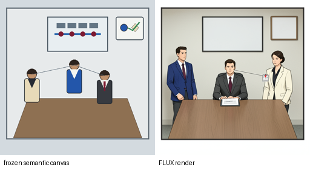

- Canvas ID: `epistemic_canvas_b01e9e2b4ca6d9826d81fd3a92018d56`
- Canvas SHA-256: `470ccb0f2b109d27c1fee97bab3c23e3249cfd19261a1c36318ba05979dbe913`
- Render key: `2bc2859d005bf1be2de25e973843cc5c2c38b1533c3ec8486ed49c33ea2ba070`
- Epistemic class: `grounded`
- Reality authority: `False`

Human render-gap review (intentionally blank):

- canvas semantics preserved:
- principal identities preserved:
- audience count preserved:
- role positions preserved:
- attention direction preserved:
- official marker preserved:
- pending marker preserved:
- grounded/imagined panel meaning preserved:
- no extra person:
- no duplicate person:
- no unsupported aggression:
- no unsupported status symbol:
- no readable text artifact:
- render introduces a new fact:
- usable for later Racio vision:

## absent / broken

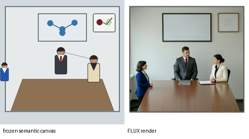

- Canvas ID: `epistemic_canvas_8e692b2afbd217c7f77ccfb9b44284eb`
- Canvas SHA-256: `22b64735bca0b6e34d0c42f577b30cf7110cc8fbebed110d3812c213b4fa518f`
- Render key: `b1a933605cfd8ca92b8da4b418eabc97f489d03653f112c6e13856be6a56977e`
- Epistemic class: `grounded`
- Reality authority: `False`

Human render-gap review (intentionally blank):

- canvas semantics preserved:
- principal identities preserved:
- audience count preserved:
- role positions preserved:
- attention direction preserved:
- official marker preserved:
- pending marker preserved:
- grounded/imagined panel meaning preserved:
- no extra person:
- no duplicate person:
- no unsupported aggression:
- no unsupported status symbol:
- no readable text artifact:
- render introduces a new fact:
- usable for later Racio vision:

## absent / no_response_completion

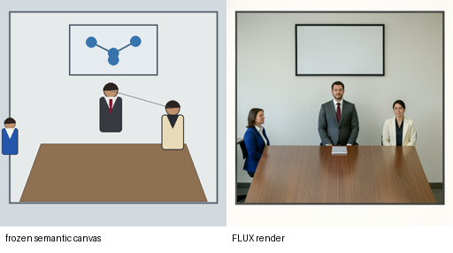

- Canvas ID: `epistemic_canvas_40ff4081084f4ffff745929eae6b0d50`
- Canvas SHA-256: `3485909c278a337a83e3715cb43c288fe80e4733d9fa992577f181451459d0ba`
- Render key: `02dd2229b722b0fa163e8ccc81c536e12934bd0925aa49024e75f0fb145a7919`
- Epistemic class: `imagined`
- Reality authority: `False`

Human render-gap review (intentionally blank):

- canvas semantics preserved:
- principal identities preserved:
- audience count preserved:
- role positions preserved:
- attention direction preserved:
- official marker preserved:
- pending marker preserved:
- grounded/imagined panel meaning preserved:
- no extra person:
- no duplicate person:
- no unsupported aggression:
- no unsupported status symbol:
- no readable text artifact:
- render introduces a new fact:
- usable for later Racio vision:

## absent / private_action

- Canvas ID: `epistemic_canvas_7af86481939aa36b37d697a106584529`
- Canvas SHA-256: `c1559d33b748c33e1975110924b0ce6583d82e362bee397094b3c93c81c391cb`
- Render key: `ef5d633f3a3af956e545c461b675ed0f0f5eac9c7483cd6c1a6c9f37e54ef1aa`
- Epistemic class: `grounded`
- Reality authority: `False`

Human render-gap review (intentionally blank):

- canvas semantics preserved:
- principal identities preserved:
- audience count preserved:
- role positions preserved:
- attention direction preserved:
- official marker preserved:
- pending marker preserved:
- grounded/imagined panel meaning preserved:
- no extra person:
- no duplicate person:
- no unsupported aggression:
- no unsupported status symbol:
- no readable text artifact:
- render introduces a new fact:
- usable for later Racio vision:

## absent / private_result

- Canvas ID: `epistemic_canvas_9dc3b20db7f20f19bd049db60ba47c35`
- Canvas SHA-256: `6486775011d2299dcd8e1010afe457b0d9bb84f011620fa6fde7fe038eb3a260`
- Render key: `66b5a6bb7a6f873c812656c20f382f962c8a283b0935690213df26cb6866d5a1`
- Epistemic class: `grounded`
- Reality authority: `False`

Human render-gap review (intentionally blank):

- canvas semantics preserved:
- principal identities preserved:
- audience count preserved:
- role positions preserved:
- attention direction preserved:
- official marker preserved:
- pending marker preserved:
- grounded/imagined panel meaning preserved:
- no extra person:
- no duplicate person:
- no unsupported aggression:
- no unsupported status symbol:
- no readable text artifact:
- render introduces a new fact:
- usable for later Racio vision:

## absent / private_completion

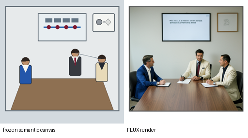

- Canvas ID: `epistemic_canvas_b8ab987988c0fcb3cbd97f3abcaba084`
- Canvas SHA-256: `98a1406d7f1516e59d61d2243f2d8f36392b7e2a9afe94ac23917d7f89990ed2`
- Render key: `9a76efd5958b395e43ab4914906ed6f22df8e09cc3e3d9f44d2e1078afe3e513`
- Epistemic class: `imagined`
- Reality authority: `False`

Human render-gap review (intentionally blank):

- canvas semantics preserved:
- principal identities preserved:
- audience count preserved:
- role positions preserved:
- attention direction preserved:
- official marker preserved:
- pending marker preserved:
- grounded/imagined panel meaning preserved:
- no extra person:
- no duplicate person:
- no unsupported aggression:
- no unsupported status symbol:
- no readable text artifact:
- render introduces a new fact:
- usable for later Racio vision:

## absent / public_action

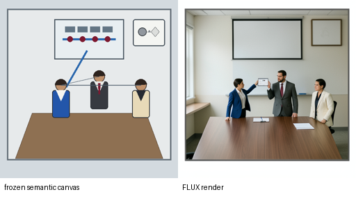

- Canvas ID: `epistemic_canvas_5b4cb4a4e3920858dfdd66b6004b6055`
- Canvas SHA-256: `058fc34b82d5faae48bbb132fe737bd75cf3ce10195d84e66044abcd595f048d`
- Render key: `d079025ac5d1ea69e364d650a21c0a5b5d638fd08c83bf057ce09f1960534015`
- Epistemic class: `grounded`
- Reality authority: `False`

Human render-gap review (intentionally blank):

- canvas semantics preserved:
- principal identities preserved:
- audience count preserved:
- role positions preserved:
- attention direction preserved:
- official marker preserved:
- pending marker preserved:
- grounded/imagined panel meaning preserved:
- no extra person:
- no duplicate person:
- no unsupported aggression:
- no unsupported status symbol:
- no readable text artifact:
- render introduces a new fact:
- usable for later Racio vision:

## absent / public_result

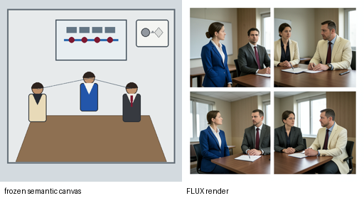

- Canvas ID: `epistemic_canvas_e1cf271b1b3c6a4bb880a7d99fc36ab4`
- Canvas SHA-256: `87a79293d4a3645feab6c8acb3420ab1dbf6ff42d22e3a6530a78dbbb9bfe145`
- Render key: `799ce27de89c3e04f81840ae7046cd764fff25dac2ce52c67b03f7ded3e4fcc9`
- Epistemic class: `grounded`
- Reality authority: `False`

Human render-gap review (intentionally blank):

- canvas semantics preserved:
- principal identities preserved:
- audience count preserved:
- role positions preserved:
- attention direction preserved:
- official marker preserved:
- pending marker preserved:
- grounded/imagined panel meaning preserved:
- no extra person:
- no duplicate person:
- no unsupported aggression:
- no unsupported status symbol:
- no readable text artifact:
- render introduces a new fact:
- usable for later Racio vision:

## absent / public_completion

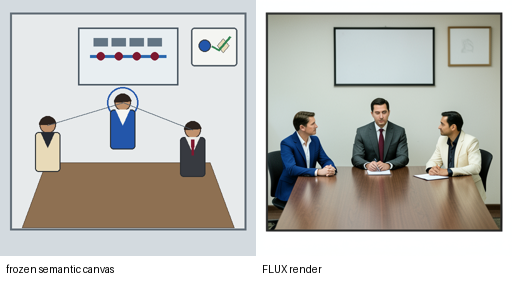

- Canvas ID: `epistemic_canvas_034e5d0d7fdf13951ed89d0283fc16be`
- Canvas SHA-256: `f41a5dfe693dfccd40196bc74fb855d66e5282ef1566deb3fd435a5fe7c0da71`
- Render key: `6c37d771934ab1c603ef19f2415e11a682cdf7ca8b581c403f51fa4a57068773`
- Epistemic class: `imagined`
- Reality authority: `False`

Human render-gap review (intentionally blank):

- canvas semantics preserved:
- principal identities preserved:
- audience count preserved:
- role positions preserved:
- attention direction preserved:
- official marker preserved:
- pending marker preserved:
- grounded/imagined panel meaning preserved:
- no extra person:
- no duplicate person:
- no unsupported aggression:
- no unsupported status symbol:
- no readable text artifact:
- render introduces a new fact:
- usable for later Racio vision:

## visible option-lane review

- action/result/completion remain distinct:
- public grounded result remains distinct from desired:
- imagined completion remains distinct from grounded result:
- no-response completion does not overwrite grounded current state:

## absent option-lane review

- action/result/completion remain distinct:
- public grounded result remains distinct from desired:
- imagined completion remains distinct from grounded result:
- no-response completion does not overwrite grounded current state:
