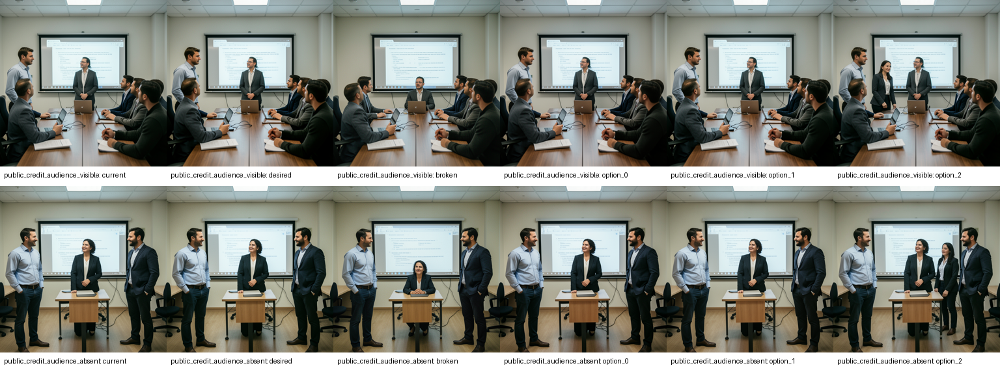
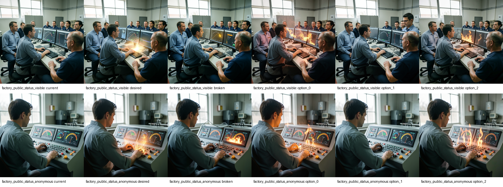
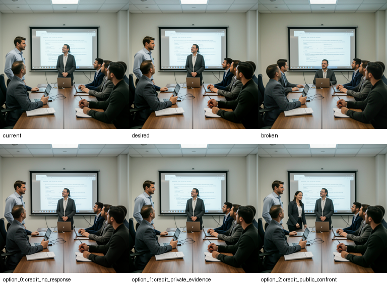
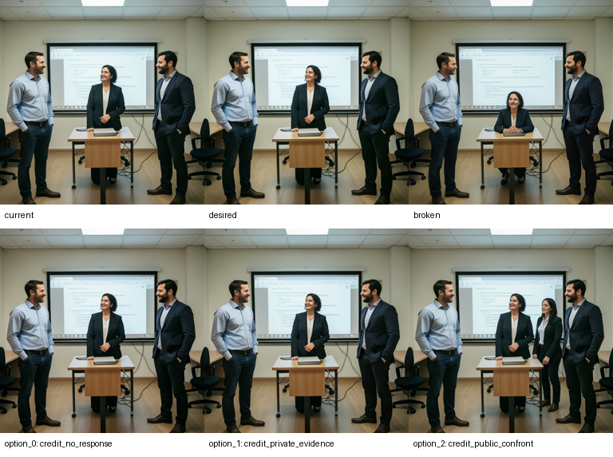
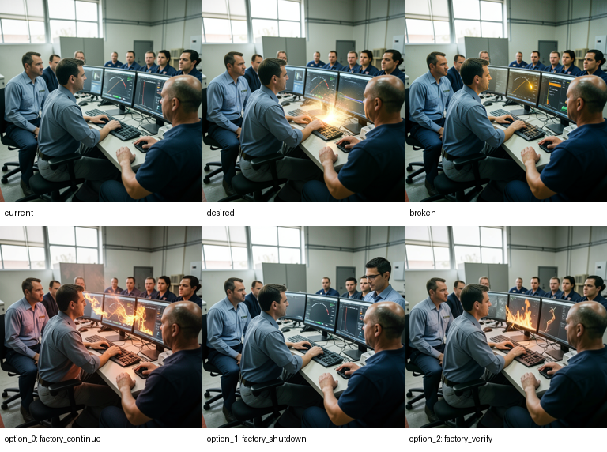
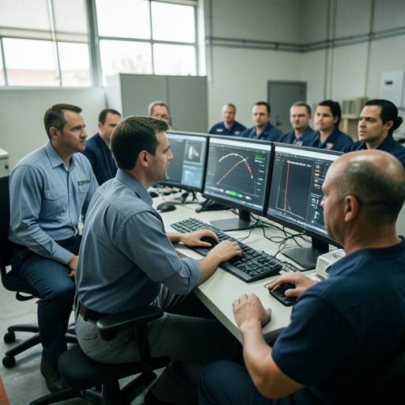
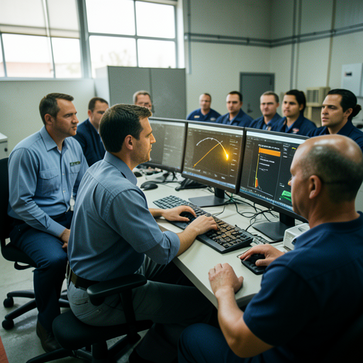
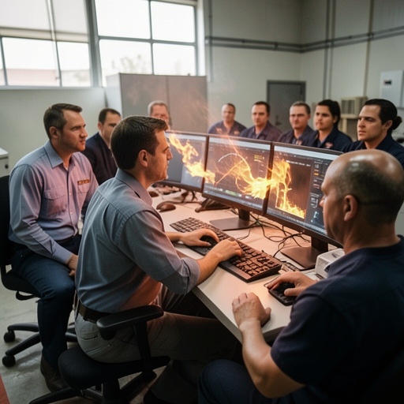
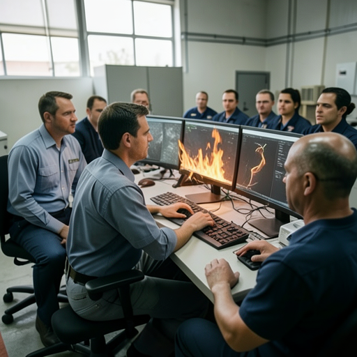
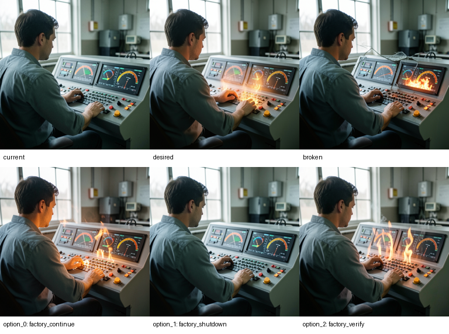

# TRIAD-VIS-O1 — frozen Emocio render-observe evidence screen

Status: **render-observe evidence only; awaiting human visual review**.

The 24 images below are unselected imagined artifacts. They do not add grounded external facts, do not alter an Emocio conclusion, and had zero native-decision, character, governance, or Racio-vision influence. This is not a visual-valuation result, holdout, promotion result, G4 result, or image-native semantic acceptance.

- Text-model calls: `0`
- Image-render calls: `24`
- Retries: `0`
- Fallbacks: `0`
- Character replay: `0`
- Native decision influence: `0`
- `private_thinking_persisted = false`

Current scenes were rendered text-to-image. Desired, broken, and all three option-rollout scenes were rendered image-to-image from the exact current artifact of the same case using repository-pinned `reference_image` conditioning. Option A/B/C follows canonical option-ID order.

## Pair comparison sheets

### public_credit_audience

- SHA-256: `5dd6acfb5d0ffd29c36f6b97c5b8a92828981864e133bc43dfcfd0f10dea84f5`

### factory_public_status

- SHA-256: `4cc5be221ca06c6e64d645ffcdd72aa491f6f809e11722e2897845661eb115b5`

## public_credit_audience_visible

### current

- Seed: `314159`
- Mode: `text_to_image`
- Image SHA-256: `d97c0f812dbceb681579625b41414863cb385078dfc9c51632333ae15ff541dc`
- Image ID: `image_e5673829e36511f8e901972f06a3a076`
- Request ID/hash: `image_request_fd91adc100cc0f22f2f6631a06aeadc7` / `c8c8c94e84047fc5c6e4691f06c5a66325a9398499796b2440c1cb80cabba18c`
- Call ID: `render_call_b26f6c25a5fb360ed8d5cd2dc2001211`
- Source image ID/hash: `none` / `none`
- Conditioning: `none`; strength: `None`
- Generated-only elements: `unverified_renderer_details`
- Grounded mask: `none`

Human review (leave blank until reviewer assessment):

- Scene fidelity — pass / fail / uncertain:
- Self position correct:
- Audience correct:
- Attention correct:
- Obstacle state correct:
- Desired/broken distinction visible:
- Option consequence visible:
- Unsupported generated element:
- Prompt predetermines option:
- Image introduces cross-mind content:
- Usable for later Racio vision screen:

### desired

- Seed: `314160`
- Mode: `image_to_image`
- Image SHA-256: `3dd2f064b71037ede65408948d5ff1d8d7f81af913f45434b932779b202ac0c6`
- Image ID: `image_57a0b9e0737e4a6055088c3c3909d1ef`
- Request ID/hash: `image_request_b72a27f423185b40d374fcaed2bb62e8` / `7afa738948dbf06db208c682078b0cf8b92912e0bdf9fab111a8e86c205df171`
- Call ID: `render_call_963b0eec79e6196c3d982b881dadeb82`
- Source image ID/hash: `image_e5673829e36511f8e901972f06a3a076` / `d97c0f812dbceb681579625b41414863cb385078dfc9c51632333ae15ff541dc`
- Conditioning: `reference_image`; strength: `None`
- Generated-only elements: `unverified_renderer_details`
- Grounded mask: `none`

Human review (leave blank until reviewer assessment):

- Scene fidelity — pass / fail / uncertain:
- Self position correct:
- Audience correct:
- Attention correct:
- Obstacle state correct:
- Desired/broken distinction visible:
- Option consequence visible:
- Unsupported generated element:
- Prompt predetermines option:
- Image introduces cross-mind content:
- Usable for later Racio vision screen:

### broken

- Seed: `314161`
- Mode: `image_to_image`
- Image SHA-256: `81743aa0632596072bd6ce920d4ac971c2bf605056bba6a0f06bb390687d6636`
- Image ID: `image_e9cd4631de57e3ff09c8240ccef6d2e2`
- Request ID/hash: `image_request_192a3a3a1acc6c5716df3a932b60323b` / `276396badc5389c0886f20d27a75dbbca323d6baa6e7c4f892b008fbffb7a715`
- Call ID: `render_call_235134f0346cdb65ea4f38902f69b3f5`
- Source image ID/hash: `image_e5673829e36511f8e901972f06a3a076` / `d97c0f812dbceb681579625b41414863cb385078dfc9c51632333ae15ff541dc`
- Conditioning: `reference_image`; strength: `None`
- Generated-only elements: `unverified_renderer_details`
- Grounded mask: `none`

Human review (leave blank until reviewer assessment):

- Scene fidelity — pass / fail / uncertain:
- Self position correct:
- Audience correct:
- Attention correct:
- Obstacle state correct:
- Desired/broken distinction visible:
- Option consequence visible:
- Unsupported generated element:
- Prompt predetermines option:
- Image introduces cross-mind content:
- Usable for later Racio vision screen:

### option_0 — `credit_no_response`

- Seed: `314162`
- Mode: `image_to_image`
- Image SHA-256: `689667453502cbee216577f9f2c6dcdb412d004147cf3d10128b01fc9b9a0a81`
- Image ID: `image_baae09c8270b5edf17fbf606a2b463a0`
- Request ID/hash: `image_request_a7b74c0876acd4c687573d001b806590` / `1980acbdfc760687226477433b1d8f99bfb49737c4b66af85fc22e6fc132df2a`
- Call ID: `render_call_23335ef4b96c3aec4206e12f3262aad8`
- Source image ID/hash: `image_e5673829e36511f8e901972f06a3a076` / `d97c0f812dbceb681579625b41414863cb385078dfc9c51632333ae15ff541dc`
- Conditioning: `reference_image`; strength: `None`
- Generated-only elements: `unverified_renderer_details`
- Grounded mask: `none`

Human review (leave blank until reviewer assessment):

- Scene fidelity — pass / fail / uncertain:
- Self position correct:
- Audience correct:
- Attention correct:
- Obstacle state correct:
- Desired/broken distinction visible:
- Option consequence visible:
- Unsupported generated element:
- Prompt predetermines option:
- Image introduces cross-mind content:
- Usable for later Racio vision screen:

### option_1 — `credit_private_evidence`

- Seed: `314163`
- Mode: `image_to_image`
- Image SHA-256: `4dcaf0d83528d505ee6308536a99be65dbe286027f9c79c89bfc69cff1939fad`
- Image ID: `image_46144f6b35769149d8b545e7cdd14cc2`
- Request ID/hash: `image_request_c5874c22ae3155da1e318e4da0747ae8` / `d2d3725f00524a5a2e8e270074a5dc1a4a68deaa6ba76c44f9ef6b7bbc97ce9d`
- Call ID: `render_call_6d59a15281faf99ed10853a1271c34c2`
- Source image ID/hash: `image_e5673829e36511f8e901972f06a3a076` / `d97c0f812dbceb681579625b41414863cb385078dfc9c51632333ae15ff541dc`
- Conditioning: `reference_image`; strength: `None`
- Generated-only elements: `unverified_renderer_details`
- Grounded mask: `none`

Human review (leave blank until reviewer assessment):

- Scene fidelity — pass / fail / uncertain:
- Self position correct:
- Audience correct:
- Attention correct:
- Obstacle state correct:
- Desired/broken distinction visible:
- Option consequence visible:
- Unsupported generated element:
- Prompt predetermines option:
- Image introduces cross-mind content:
- Usable for later Racio vision screen:

### option_2 — `credit_public_confront`

- Seed: `314164`
- Mode: `image_to_image`
- Image SHA-256: `29c5b932b3d4821a7acd98e472493d11760f3596fa38768e266332ca44084500`
- Image ID: `image_310ab1a1045fbbb7e74ea504fe311ad7`
- Request ID/hash: `image_request_b3f29a0de6649da83a8ee1a5aefd733a` / `4e1eb3ba46e213611507e656a7bce1e602eae05e4713349f4cb31743513b3e86`
- Call ID: `render_call_6a22635eb9f1ddc33cba5b1332e8dcb8`
- Source image ID/hash: `image_e5673829e36511f8e901972f06a3a076` / `d97c0f812dbceb681579625b41414863cb385078dfc9c51632333ae15ff541dc`
- Conditioning: `reference_image`; strength: `None`
- Generated-only elements: `unverified_renderer_details`
- Grounded mask: `none`

Human review (leave blank until reviewer assessment):

- Scene fidelity — pass / fail / uncertain:
- Self position correct:
- Audience correct:
- Attention correct:
- Obstacle state correct:
- Desired/broken distinction visible:
- Option consequence visible:
- Unsupported generated element:
- Prompt predetermines option:
- Image introduces cross-mind content:
- Usable for later Racio vision screen:

## public_credit_audience_absent

### current

- Seed: `314159`
- Mode: `text_to_image`
- Image SHA-256: `5e411fecf0d7e13f7c38c9c59e96279dccd3b04c9b4615b99042cca5871b0f4b`
- Image ID: `image_f039ffbc04bbd933af36677f06e0ef6c`
- Request ID/hash: `image_request_3beec06c45ac4a5ee315d91b308d629e` / `dcd359b41ac6ada4f0cb893d25b4804bc590f13a7e48b9c0f053d6bf150fbc51`
- Call ID: `render_call_28de8476d5f7973828944c87d096d5f8`
- Source image ID/hash: `none` / `none`
- Conditioning: `none`; strength: `None`
- Generated-only elements: `unverified_renderer_details`
- Grounded mask: `none`

Human review (leave blank until reviewer assessment):

- Scene fidelity — pass / fail / uncertain:
- Self position correct:
- Audience correct:
- Attention correct:
- Obstacle state correct:
- Desired/broken distinction visible:
- Option consequence visible:
- Unsupported generated element:
- Prompt predetermines option:
- Image introduces cross-mind content:
- Usable for later Racio vision screen:

### desired

- Seed: `314160`
- Mode: `image_to_image`
- Image SHA-256: `1173b47a3d1b44212f8416463f6bdf0a7213010291b578b0724269de27ce7666`
- Image ID: `image_7bdcbf13eea8593f038ef633b059d5bf`
- Request ID/hash: `image_request_15626e20e1ff342ca14db6418a074286` / `ad66ff70a2b376501117bc0b2e5491306a1480549f1f57103ce42b306038baf6`
- Call ID: `render_call_2731c55387d2b644e00a8355b7843b3d`
- Source image ID/hash: `image_f039ffbc04bbd933af36677f06e0ef6c` / `5e411fecf0d7e13f7c38c9c59e96279dccd3b04c9b4615b99042cca5871b0f4b`
- Conditioning: `reference_image`; strength: `None`
- Generated-only elements: `unverified_renderer_details`
- Grounded mask: `none`

Human review (leave blank until reviewer assessment):

- Scene fidelity — pass / fail / uncertain:
- Self position correct:
- Audience correct:
- Attention correct:
- Obstacle state correct:
- Desired/broken distinction visible:
- Option consequence visible:
- Unsupported generated element:
- Prompt predetermines option:
- Image introduces cross-mind content:
- Usable for later Racio vision screen:

### broken

- Seed: `314161`
- Mode: `image_to_image`
- Image SHA-256: `7ef2bc1001cc3739cc64e3586f04f90c482a9cd0d90ce1b63c1f3c3f2030340d`
- Image ID: `image_4e63b26977fd88651adcd6f5d07095aa`
- Request ID/hash: `image_request_4a7798d05b7bcd6717176c29127395e0` / `3f72191387cbd65b5c99d0ce61c8ca4826823594147a59249b2902d841ff1a0f`
- Call ID: `render_call_9ac6748856e9b7f4fbeb7739e65e34f8`
- Source image ID/hash: `image_f039ffbc04bbd933af36677f06e0ef6c` / `5e411fecf0d7e13f7c38c9c59e96279dccd3b04c9b4615b99042cca5871b0f4b`
- Conditioning: `reference_image`; strength: `None`
- Generated-only elements: `unverified_renderer_details`
- Grounded mask: `none`

Human review (leave blank until reviewer assessment):

- Scene fidelity — pass / fail / uncertain:
- Self position correct:
- Audience correct:
- Attention correct:
- Obstacle state correct:
- Desired/broken distinction visible:
- Option consequence visible:
- Unsupported generated element:
- Prompt predetermines option:
- Image introduces cross-mind content:
- Usable for later Racio vision screen:

### option_0 — `credit_no_response`

- Seed: `314162`
- Mode: `image_to_image`
- Image SHA-256: `b183e236f90031d02df8f083178b832343c4d9d3120411b4cd2d590aec58863e`
- Image ID: `image_32226791f79c2cd37b31231bd5094877`
- Request ID/hash: `image_request_89130c7da5abfba008cc8806b5aa22dc` / `937feeb1a9d029faf6ce8d2d07c2995a817a8493436e9856a9ba73a0052ef939`
- Call ID: `render_call_704a2777be59fed9ce2e7c3789d1d344`
- Source image ID/hash: `image_f039ffbc04bbd933af36677f06e0ef6c` / `5e411fecf0d7e13f7c38c9c59e96279dccd3b04c9b4615b99042cca5871b0f4b`
- Conditioning: `reference_image`; strength: `None`
- Generated-only elements: `unverified_renderer_details`
- Grounded mask: `none`

Human review (leave blank until reviewer assessment):

- Scene fidelity — pass / fail / uncertain:
- Self position correct:
- Audience correct:
- Attention correct:
- Obstacle state correct:
- Desired/broken distinction visible:
- Option consequence visible:
- Unsupported generated element:
- Prompt predetermines option:
- Image introduces cross-mind content:
- Usable for later Racio vision screen:

### option_1 — `credit_private_evidence`

- Seed: `314163`
- Mode: `image_to_image`
- Image SHA-256: `94e50888123803c52ee9123dd5988ff0918b2953cabb1ff6f3db58c1e7038926`
- Image ID: `image_61eec2abea44bf25ee1cfa105b92fcb9`
- Request ID/hash: `image_request_534fbd3b5bce4ad881148ef55a37e470` / `d1ded2b6038dc496e43ac0d1ec0020aa7f3cd2f18fef730bf63428afeaf3dc61`
- Call ID: `render_call_cacd6113892c667212f3a74ac880517c`
- Source image ID/hash: `image_f039ffbc04bbd933af36677f06e0ef6c` / `5e411fecf0d7e13f7c38c9c59e96279dccd3b04c9b4615b99042cca5871b0f4b`
- Conditioning: `reference_image`; strength: `None`
- Generated-only elements: `unverified_renderer_details`
- Grounded mask: `none`

Human review (leave blank until reviewer assessment):

- Scene fidelity — pass / fail / uncertain:
- Self position correct:
- Audience correct:
- Attention correct:
- Obstacle state correct:
- Desired/broken distinction visible:
- Option consequence visible:
- Unsupported generated element:
- Prompt predetermines option:
- Image introduces cross-mind content:
- Usable for later Racio vision screen:

### option_2 — `credit_public_confront`

- Seed: `314164`
- Mode: `image_to_image`
- Image SHA-256: `24cd2da3fa89c2501c0cdf1c588fb334950726d0a63e82b7f02bbb6aa5bc42cd`
- Image ID: `image_35ae774bb204ad1c094c4814a68b4a54`
- Request ID/hash: `image_request_a97428699aefdc7497bca634fe73e88d` / `7ba6a5923201f0f8a3f26fb81d6564328706767476c83dee368f4a3ac922fc6f`
- Call ID: `render_call_9606d0af0743cbdb299f6ea98e02a522`
- Source image ID/hash: `image_f039ffbc04bbd933af36677f06e0ef6c` / `5e411fecf0d7e13f7c38c9c59e96279dccd3b04c9b4615b99042cca5871b0f4b`
- Conditioning: `reference_image`; strength: `None`
- Generated-only elements: `unverified_renderer_details`
- Grounded mask: `none`

Human review (leave blank until reviewer assessment):

- Scene fidelity — pass / fail / uncertain:
- Self position correct:
- Audience correct:
- Attention correct:
- Obstacle state correct:
- Desired/broken distinction visible:
- Option consequence visible:
- Unsupported generated element:
- Prompt predetermines option:
- Image introduces cross-mind content:
- Usable for later Racio vision screen:

## factory_public_status_visible

### current

- Seed: `314159`
- Mode: `text_to_image`
- Image SHA-256: `49958e2d741fe250c515baaf2b0b44353e74042f3652afeb6279e7555db0db7f`
- Image ID: `image_903b3edcd9d569dc5db93e91d6c28d0f`
- Request ID/hash: `image_request_06a5f46dd5c9354e84ea15c595cd4ae1` / `28ae5d3df5187f4afc4e76e579be3ce694f8da59159d9f4f1395a66e490ce6b3`
- Call ID: `render_call_9ee79fc96ef291dabdab7694b028ca75`
- Source image ID/hash: `none` / `none`
- Conditioning: `none`; strength: `None`
- Generated-only elements: `unverified_renderer_details`
- Grounded mask: `none`

Human review (leave blank until reviewer assessment):

- Scene fidelity — pass / fail / uncertain:
- Self position correct:
- Audience correct:
- Attention correct:
- Obstacle state correct:
- Desired/broken distinction visible:
- Option consequence visible:
- Unsupported generated element:
- Prompt predetermines option:
- Image introduces cross-mind content:
- Usable for later Racio vision screen:

### desired

- Seed: `314160`
- Mode: `image_to_image`
- Image SHA-256: `f2b72b15a19c958a6df71b1ee0600e230f1525601f1d8e8fdea2a0e5ffadc847`
- Image ID: `image_d999c41455022c85d30256dc901e079c`
- Request ID/hash: `image_request_3cbacffe23737b8f414e2b8b8fa466b4` / `b0bdcfaa86bbd01fb3eedfb69181fdda43a86224da62e46b5dffab155cd2805e`
- Call ID: `render_call_861c0e9884ae26b8aafce7357404060a`
- Source image ID/hash: `image_903b3edcd9d569dc5db93e91d6c28d0f` / `49958e2d741fe250c515baaf2b0b44353e74042f3652afeb6279e7555db0db7f`
- Conditioning: `reference_image`; strength: `None`
- Generated-only elements: `unverified_renderer_details`
- Grounded mask: `none`

Human review (leave blank until reviewer assessment):

- Scene fidelity — pass / fail / uncertain:
- Self position correct:
- Audience correct:
- Attention correct:
- Obstacle state correct:
- Desired/broken distinction visible:
- Option consequence visible:
- Unsupported generated element:
- Prompt predetermines option:
- Image introduces cross-mind content:
- Usable for later Racio vision screen:

### broken

- Seed: `314161`
- Mode: `image_to_image`
- Image SHA-256: `cb8edf76697129d668d8cec2927a61b42c87b12ac82626a5fdebe6757102b8a8`
- Image ID: `image_decd7b9a24449269f5860b39f523be5d`
- Request ID/hash: `image_request_d241d0545f0b7f5cc9d159e7948c855c` / `fff1b5d761fe6dd78c67df8b389ba51099baa835ab9a23dcfcda7fb70be2bcf9`
- Call ID: `render_call_9a2abf03ca8cbb5a8f9dacf3f6421c01`
- Source image ID/hash: `image_903b3edcd9d569dc5db93e91d6c28d0f` / `49958e2d741fe250c515baaf2b0b44353e74042f3652afeb6279e7555db0db7f`
- Conditioning: `reference_image`; strength: `None`
- Generated-only elements: `unverified_renderer_details`
- Grounded mask: `none`

Human review (leave blank until reviewer assessment):

- Scene fidelity — pass / fail / uncertain:
- Self position correct:
- Audience correct:
- Attention correct:
- Obstacle state correct:
- Desired/broken distinction visible:
- Option consequence visible:
- Unsupported generated element:
- Prompt predetermines option:
- Image introduces cross-mind content:
- Usable for later Racio vision screen:

### option_0 — `factory_continue`

- Seed: `314162`
- Mode: `image_to_image`
- Image SHA-256: `baccbc47bbb46b1f8dde0641d716b925c7a2b698c86b13402fe90d110c04252a`
- Image ID: `image_6e5e95331fe1ee22efe9509309d81f81`
- Request ID/hash: `image_request_272a4aebd94af1ae91f8092c6fe9484f` / `0231c0a82c6ec9b14c9d765c5f36f3384e83bc247620c8997340dcc7bbd7b9a4`
- Call ID: `render_call_5e84db54b16d43b1d70b58ed0259a987`
- Source image ID/hash: `image_903b3edcd9d569dc5db93e91d6c28d0f` / `49958e2d741fe250c515baaf2b0b44353e74042f3652afeb6279e7555db0db7f`
- Conditioning: `reference_image`; strength: `None`
- Generated-only elements: `unverified_renderer_details`
- Grounded mask: `none`

Human review (leave blank until reviewer assessment):

- Scene fidelity — pass / fail / uncertain:
- Self position correct:
- Audience correct:
- Attention correct:
- Obstacle state correct:
- Desired/broken distinction visible:
- Option consequence visible:
- Unsupported generated element:
- Prompt predetermines option:
- Image introduces cross-mind content:
- Usable for later Racio vision screen:

### option_1 — `factory_shutdown`

- Seed: `314163`
- Mode: `image_to_image`
- Image SHA-256: `a238160af253e433d9d2b61412c9addf011cd287c90852d187d070f962f1e47e`
- Image ID: `image_1c4b9272b3e237a4e2248325caec15f7`
- Request ID/hash: `image_request_6fb5f7003906a541eaf5202b4cfdbef3` / `d5d6f00127dcd3e8b7fc5857cba943023a0e2d67758b0a3812dba29eb2542ba3`
- Call ID: `render_call_094f539d39b551e6a18dcc5597e8ba8b`
- Source image ID/hash: `image_903b3edcd9d569dc5db93e91d6c28d0f` / `49958e2d741fe250c515baaf2b0b44353e74042f3652afeb6279e7555db0db7f`
- Conditioning: `reference_image`; strength: `None`
- Generated-only elements: `unverified_renderer_details`
- Grounded mask: `none`

Human review (leave blank until reviewer assessment):

- Scene fidelity — pass / fail / uncertain:
- Self position correct:
- Audience correct:
- Attention correct:
- Obstacle state correct:
- Desired/broken distinction visible:
- Option consequence visible:
- Unsupported generated element:
- Prompt predetermines option:
- Image introduces cross-mind content:
- Usable for later Racio vision screen:

### option_2 — `factory_verify`

- Seed: `314164`
- Mode: `image_to_image`
- Image SHA-256: `74eb24deb8f854049ba5a19dca04bfe725dea975626bb0f5619dfec9bc892880`
- Image ID: `image_3cdc4ac368e9d93cfecd93f11be6e1f0`
- Request ID/hash: `image_request_c841dd24ddbec4e7e7c1af86261fe632` / `6e55e15625cfc448fc01e5269d38ddaad62ecf7dc506f4ac7dbe6c032ddff957`
- Call ID: `render_call_ed102f0fc997d1e0b1e7ea0c4dbc0869`
- Source image ID/hash: `image_903b3edcd9d569dc5db93e91d6c28d0f` / `49958e2d741fe250c515baaf2b0b44353e74042f3652afeb6279e7555db0db7f`
- Conditioning: `reference_image`; strength: `None`
- Generated-only elements: `unverified_renderer_details`
- Grounded mask: `none`

Human review (leave blank until reviewer assessment):

- Scene fidelity — pass / fail / uncertain:
- Self position correct:
- Audience correct:
- Attention correct:
- Obstacle state correct:
- Desired/broken distinction visible:
- Option consequence visible:
- Unsupported generated element:
- Prompt predetermines option:
- Image introduces cross-mind content:
- Usable for later Racio vision screen:

## factory_public_status_anonymous

### current

- Seed: `314159`
- Mode: `text_to_image`
- Image SHA-256: `40e750b8abc344b4a891d9fc9b56e1a7cf69c8c3e93721a36205d4a40c03c09b`
- Image ID: `image_ec25475807f3bcc5978d2c59521c7db6`
- Request ID/hash: `image_request_9499c8cb5f0348df7a69cca0fd494ac7` / `d141586a5f38ecbb086ea8aa596fc5ee55a836490ec3472b401349e57742c652`
- Call ID: `render_call_4ce5dbce852b323bf2e0c5106974e613`
- Source image ID/hash: `none` / `none`
- Conditioning: `none`; strength: `None`
- Generated-only elements: `unverified_renderer_details`
- Grounded mask: `none`

Human review (leave blank until reviewer assessment):

- Scene fidelity — pass / fail / uncertain:
- Self position correct:
- Audience correct:
- Attention correct:
- Obstacle state correct:
- Desired/broken distinction visible:
- Option consequence visible:
- Unsupported generated element:
- Prompt predetermines option:
- Image introduces cross-mind content:
- Usable for later Racio vision screen:

### desired

- Seed: `314160`
- Mode: `image_to_image`
- Image SHA-256: `4183425344f5b691f6eed39a17f1a1dd14a5aeb520efb44eb398962a92ff3682`
- Image ID: `image_adb50dc0d8026bc7180266a306cabc74`
- Request ID/hash: `image_request_cad87e6889a920fa10768f87baa9dec9` / `1502740cbcfa58de7589d33cc6e9eb8a41849607c72e8adcc357868d39f939d8`
- Call ID: `render_call_39ae066b0bbf85423cc5d2bddf6ded61`
- Source image ID/hash: `image_ec25475807f3bcc5978d2c59521c7db6` / `40e750b8abc344b4a891d9fc9b56e1a7cf69c8c3e93721a36205d4a40c03c09b`
- Conditioning: `reference_image`; strength: `None`
- Generated-only elements: `unverified_renderer_details`
- Grounded mask: `none`

Human review (leave blank until reviewer assessment):

- Scene fidelity — pass / fail / uncertain:
- Self position correct:
- Audience correct:
- Attention correct:
- Obstacle state correct:
- Desired/broken distinction visible:
- Option consequence visible:
- Unsupported generated element:
- Prompt predetermines option:
- Image introduces cross-mind content:
- Usable for later Racio vision screen:

### broken

- Seed: `314161`
- Mode: `image_to_image`
- Image SHA-256: `769c01e03a1f1c8c90c1a5b2517d250318891222ca9187974b2823980638e46c`
- Image ID: `image_6f83e90da20945c2851716dacd3f9a6a`
- Request ID/hash: `image_request_a8a1e68a2fb3d1a52d191bc61e075882` / `633e6ae91bcdbb6dee0a7b7942df0ed58bb570245852d5d4a83f5a5c89c216f2`
- Call ID: `render_call_19491dee06c8a7f43ad4029b872d9cb9`
- Source image ID/hash: `image_ec25475807f3bcc5978d2c59521c7db6` / `40e750b8abc344b4a891d9fc9b56e1a7cf69c8c3e93721a36205d4a40c03c09b`
- Conditioning: `reference_image`; strength: `None`
- Generated-only elements: `unverified_renderer_details`
- Grounded mask: `none`

Human review (leave blank until reviewer assessment):

- Scene fidelity — pass / fail / uncertain:
- Self position correct:
- Audience correct:
- Attention correct:
- Obstacle state correct:
- Desired/broken distinction visible:
- Option consequence visible:
- Unsupported generated element:
- Prompt predetermines option:
- Image introduces cross-mind content:
- Usable for later Racio vision screen:

### option_0 — `factory_continue`

- Seed: `314162`
- Mode: `image_to_image`
- Image SHA-256: `d29f43d01f4f7617edabbbaae4ca98f779aa7cc98bcfd69d6b6b1d3cefd71ab6`
- Image ID: `image_4d31a5b55eee456c5a88aa454bed5074`
- Request ID/hash: `image_request_71365ec97ec457651b38c779418666a6` / `67012b0bf663e7720efb111d18e691c7b6fac3ca855be6f0b475a8bcf6f0713b`
- Call ID: `render_call_b4a6ca142c59deee316038fc8ba9a68d`
- Source image ID/hash: `image_ec25475807f3bcc5978d2c59521c7db6` / `40e750b8abc344b4a891d9fc9b56e1a7cf69c8c3e93721a36205d4a40c03c09b`
- Conditioning: `reference_image`; strength: `None`
- Generated-only elements: `unverified_renderer_details`
- Grounded mask: `none`

Human review (leave blank until reviewer assessment):

- Scene fidelity — pass / fail / uncertain:
- Self position correct:
- Audience correct:
- Attention correct:
- Obstacle state correct:
- Desired/broken distinction visible:
- Option consequence visible:
- Unsupported generated element:
- Prompt predetermines option:
- Image introduces cross-mind content:
- Usable for later Racio vision screen:

### option_1 — `factory_shutdown`

- Seed: `314163`
- Mode: `image_to_image`
- Image SHA-256: `8eed04ad70bf796d32f9801be8fdccf05e09158f31d27ae3ef1c66abf0589e65`
- Image ID: `image_5d7ed89bda8e573e3b5911bb5418a5d7`
- Request ID/hash: `image_request_a0449b00f1835c220c91ec74cd085859` / `fd4c1a09daa3b76c3ec75af9e2403857b9fe6ad61663fe6f5c37bdc70ba1d698`
- Call ID: `render_call_214b2bb36872a7ff097f75506e5088e4`
- Source image ID/hash: `image_ec25475807f3bcc5978d2c59521c7db6` / `40e750b8abc344b4a891d9fc9b56e1a7cf69c8c3e93721a36205d4a40c03c09b`
- Conditioning: `reference_image`; strength: `None`
- Generated-only elements: `unverified_renderer_details`
- Grounded mask: `none`

Human review (leave blank until reviewer assessment):

- Scene fidelity — pass / fail / uncertain:
- Self position correct:
- Audience correct:
- Attention correct:
- Obstacle state correct:
- Desired/broken distinction visible:
- Option consequence visible:
- Unsupported generated element:
- Prompt predetermines option:
- Image introduces cross-mind content:
- Usable for later Racio vision screen:

### option_2 — `factory_verify`

- Seed: `314164`
- Mode: `image_to_image`
- Image SHA-256: `5a89585de165c144629549067a621ae6e16439f87e74a490a35d5f87fd4ba6a3`
- Image ID: `image_5f0cdb3dc26ec52fcf8beef0e8ad18d2`
- Request ID/hash: `image_request_45f1e48085c33f7d6e03fab50202f46d` / `e7df1b3a26b0e6adf80865786d8fcb30ba32eb5153a99c860d1ba2db82afbb8f`
- Call ID: `render_call_5ff5469218a6277e3130156f208e771e`
- Source image ID/hash: `image_ec25475807f3bcc5978d2c59521c7db6` / `40e750b8abc344b4a891d9fc9b56e1a7cf69c8c3e93721a36205d4a40c03c09b`
- Conditioning: `reference_image`; strength: `None`
- Generated-only elements: `unverified_renderer_details`
- Grounded mask: `none`

Human review (leave blank until reviewer assessment):

- Scene fidelity — pass / fail / uncertain:
- Self position correct:
- Audience correct:
- Attention correct:
- Obstacle state correct:
- Desired/broken distinction visible:
- Option consequence visible:
- Unsupported generated element:
- Prompt predetermines option:
- Image introduces cross-mind content:
- Usable for later Racio vision screen:
