# TRIAD-VIS-O2 — semantic-canvas-conditioned public-credit isolation

Status: **render evidence awaiting human visual review**.

This research-only screen uses deterministic semantic canvases as reference-image conditioning. The images are imagined artifacts and have zero visual-valuation, native-conclusion, character, governance, decision, or Racio-vision authority.

- Image-model calls: `10`
- Visible scene slots: `12`
- Text-model calls: `0`
- Retries / fallbacks: `0 / 0`
- Character replay / native-decision influence / Racio vision: `0 / 0 / 0`
- `private_thinking_persisted = false`

## Overview sheets

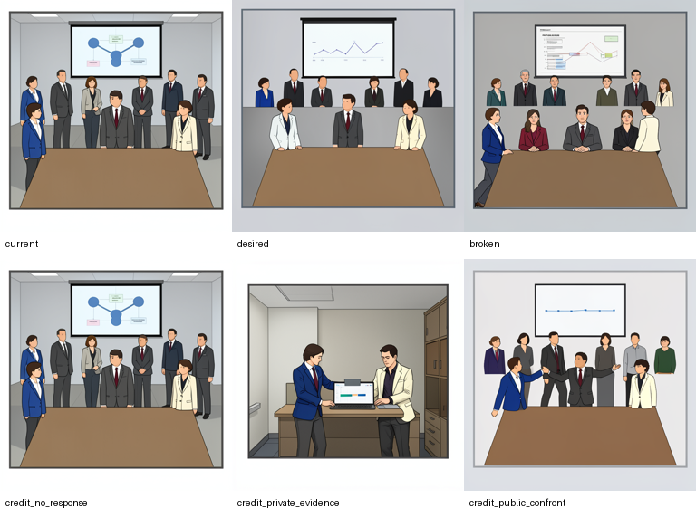

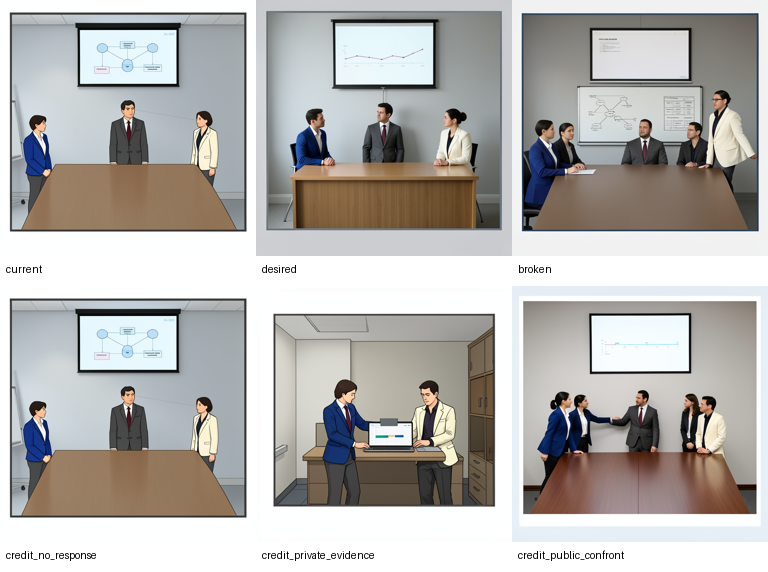

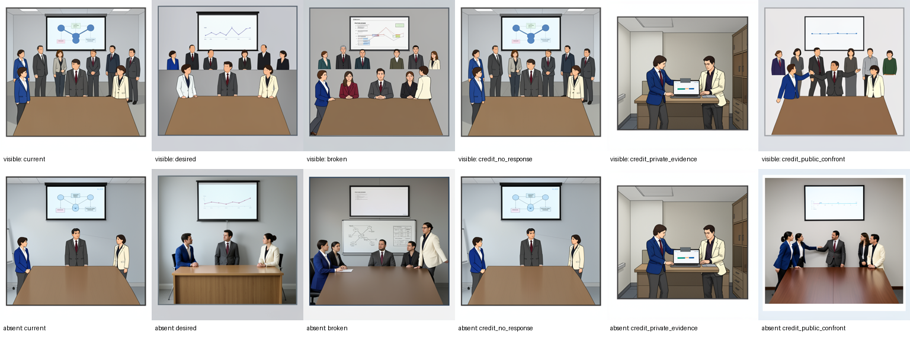

## Audience visible

### current

- Canvas: `Docs/evals/semantic_lab_v1/triad-vis-o2-2026-07-24/canvases/visible/current.png`
- Canvas SHA-256: `a0d668da5d4565ec8fc60603e15129f5f417b670b6549e69ce3ba4420062b362`
- Render: `images/visible/current.png`
- Render SHA-256: `5f8c65420dbe7b6e8c9bb71a752ab574a09a294f11658d1432e9efc6f4cc9b18`
- Execution: Call `1`; request `image_request_91caa552bb9a0eef21aabf957c3e0015`; call `render_call_194a7663c6c5430b3337f4b2544440f0`.

Human review (intentionally blank):

- Canvas matches intended semantics:
- Render follows canvas:
- Self identity stable:
- Colleague identity stable:
- Leader identity stable:
- Audience count correct:
- Camera/layout continuity correct:
- Transition mode respected:
- Self position correct:
- Attention/gaze correct:
- Obstacle state correct:
- Recognition state visible:
- Private scene truly private:
- No extra person:
- No duplicate person:
- No readable-text artifact:
- Unsupported generated detail:
- Prompt predetermines option:
- Usable for Racio vision:

### desired

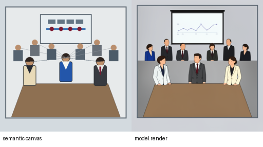

- Canvas: `Docs/evals/semantic_lab_v1/triad-vis-o2-2026-07-24/canvases/visible/desired.png`
- Canvas SHA-256: `ff519e68c4b39ad5083950656e34d77dabd1e74206c8c365329fb9eb6f98f915`
- Render: `images/visible/desired.png`
- Render SHA-256: `77b6eb11f3c86f5614d6b31cb485d0a7e6c02942128afa14e9e359d81ad99494`
- Execution: Call `3`; request `image_request_90c6fbef7160d05f3a3ac60e49157d1f`; call `render_call_9be12c7cd6ee04aeb6fe45f6fde6d2da`.

Human review (intentionally blank):

- Canvas matches intended semantics:
- Render follows canvas:
- Self identity stable:
- Colleague identity stable:
- Leader identity stable:
- Audience count correct:
- Camera/layout continuity correct:
- Transition mode respected:
- Self position correct:
- Attention/gaze correct:
- Obstacle state correct:
- Recognition state visible:
- Private scene truly private:
- No extra person:
- No duplicate person:
- No readable-text artifact:
- Unsupported generated detail:
- Prompt predetermines option:
- Usable for Racio vision:

### broken

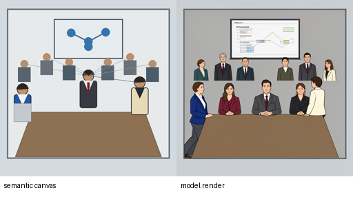

- Canvas: `Docs/evals/semantic_lab_v1/triad-vis-o2-2026-07-24/canvases/visible/broken.png`
- Canvas SHA-256: `c9811df70b4902502587d4a20919e0d30d139422f65ddb3ee01a717f2fdd8f91`
- Render: `images/visible/broken.png`
- Render SHA-256: `0da0d285bfc30da73fcb338c8d6f002c6b8fd7ef40654578a2e14b761b1f2f6f`
- Execution: Call `5`; request `image_request_95cca2c9a50c131773b7e3dac36e75b4`; call `render_call_33fe2a3c2655f75c080adaa4a6ad216c`.

Human review (intentionally blank):

- Canvas matches intended semantics:
- Render follows canvas:
- Self identity stable:
- Colleague identity stable:
- Leader identity stable:
- Audience count correct:
- Camera/layout continuity correct:
- Transition mode respected:
- Self position correct:
- Attention/gaze correct:
- Obstacle state correct:
- Recognition state visible:
- Private scene truly private:
- No extra person:
- No duplicate person:
- No readable-text artifact:
- Unsupported generated detail:
- Prompt predetermines option:
- Usable for Racio vision:

### credit_no_response

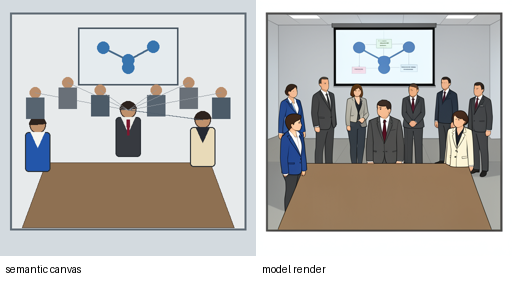

- Canvas: `Docs/evals/semantic_lab_v1/triad-vis-o2-2026-07-24/canvases/visible/credit_no_response.png`
- Canvas SHA-256: `a0d668da5d4565ec8fc60603e15129f5f417b670b6549e69ce3ba4420062b362`
- Render: `images/visible/current.png`
- Render SHA-256: `5f8c65420dbe7b6e8c9bb71a752ab574a09a294f11658d1432e9efc6f4cc9b18`
- Execution: No model call; exact current image artifact alias.

Human review (intentionally blank):

- Canvas matches intended semantics:
- Render follows canvas:
- Self identity stable:
- Colleague identity stable:
- Leader identity stable:
- Audience count correct:
- Camera/layout continuity correct:
- Transition mode respected:
- Self position correct:
- Attention/gaze correct:
- Obstacle state correct:
- Recognition state visible:
- Private scene truly private:
- No extra person:
- No duplicate person:
- No readable-text artifact:
- Unsupported generated detail:
- Prompt predetermines option:
- Usable for Racio vision:

### credit_private_evidence

- Canvas: `Docs/evals/semantic_lab_v1/triad-vis-o2-2026-07-24/canvases/visible/credit_private_evidence.png`
- Canvas SHA-256: `44534c66f492be08fcbba52a192e2a4fc337def7c983f661df73c81e5eaa353e`
- Render: `images/visible/credit_private_evidence.png`
- Render SHA-256: `8b50cb86211b21df6afc2eae88c98c391ed93d37d4d386df33a80a818bd28bfb`
- Execution: Call `7`; request `image_request_ad08be4349fa1c0f9c794afbdbaaf176`; call `render_call_a7d51afcbe7b88043fb64f90187bfbb5`.

Human review (intentionally blank):

- Canvas matches intended semantics:
- Render follows canvas:
- Self identity stable:
- Colleague identity stable:
- Leader identity stable:
- Audience count correct:
- Camera/layout continuity correct:
- Transition mode respected:
- Self position correct:
- Attention/gaze correct:
- Obstacle state correct:
- Recognition state visible:
- Private scene truly private:
- No extra person:
- No duplicate person:
- No readable-text artifact:
- Unsupported generated detail:
- Prompt predetermines option:
- Usable for Racio vision:

### credit_public_confront

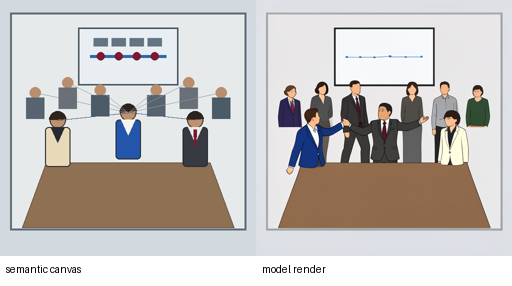

- Canvas: `Docs/evals/semantic_lab_v1/triad-vis-o2-2026-07-24/canvases/visible/credit_public_confront.png`
- Canvas SHA-256: `ff519e68c4b39ad5083950656e34d77dabd1e74206c8c365329fb9eb6f98f915`
- Render: `images/visible/credit_public_confront.png`
- Render SHA-256: `861a6f06cb97434f1374f35b7725cb8039354a5eb8720f8f067949f6b48a7322`
- Execution: Call `9`; request `image_request_87d1735860e8be76ffe1e5d481878925`; call `render_call_bc96de2f30356618f03748834b31cc52`.

Human review (intentionally blank):

- Canvas matches intended semantics:
- Render follows canvas:
- Self identity stable:
- Colleague identity stable:
- Leader identity stable:
- Audience count correct:
- Camera/layout continuity correct:
- Transition mode respected:
- Self position correct:
- Attention/gaze correct:
- Obstacle state correct:
- Recognition state visible:
- Private scene truly private:
- No extra person:
- No duplicate person:
- No readable-text artifact:
- Unsupported generated detail:
- Prompt predetermines option:
- Usable for Racio vision:

## Audience absent

### current

- Canvas: `Docs/evals/semantic_lab_v1/triad-vis-o2-2026-07-24/canvases/absent/current.png`
- Canvas SHA-256: `0ae0fef92b819c405440cb4f43b52d3d292d6e96c4926f35d5ffa79d5e4b20f6`
- Render: `images/absent/current.png`
- Render SHA-256: `808ab354d6307534798f96b673a1e6ceac8388d80a914ad4e5b47c33a173bd8d`
- Execution: Call `2`; request `image_request_936122ac5339140d5f57f6b34138ed6d`; call `render_call_399cc329f04abc242cc1d58fb5c8af5c`.

Human review (intentionally blank):

- Canvas matches intended semantics:
- Render follows canvas:
- Self identity stable:
- Colleague identity stable:
- Leader identity stable:
- Audience count correct:
- Camera/layout continuity correct:
- Transition mode respected:
- Self position correct:
- Attention/gaze correct:
- Obstacle state correct:
- Recognition state visible:
- Private scene truly private:
- No extra person:
- No duplicate person:
- No readable-text artifact:
- Unsupported generated detail:
- Prompt predetermines option:
- Usable for Racio vision:

### desired

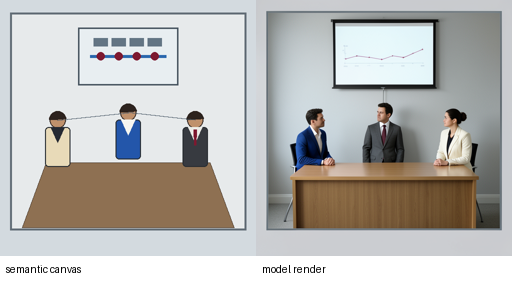

- Canvas: `Docs/evals/semantic_lab_v1/triad-vis-o2-2026-07-24/canvases/absent/desired.png`
- Canvas SHA-256: `c5ea16f53dfe3db44e8754a47f2ef3e6f2f8fb2063382e3fb730b8f9d958e084`
- Render: `images/absent/desired.png`
- Render SHA-256: `37ca20961b1b08f55333f2ee70d4c4ab70aaf39d899e003efa00c0fa6b4d3839`
- Execution: Call `4`; request `image_request_d99296c1303aeefaab9faaa1613c1990`; call `render_call_4a139379c1026bcfb98afaccb00aafe9`.

Human review (intentionally blank):

- Canvas matches intended semantics:
- Render follows canvas:
- Self identity stable:
- Colleague identity stable:
- Leader identity stable:
- Audience count correct:
- Camera/layout continuity correct:
- Transition mode respected:
- Self position correct:
- Attention/gaze correct:
- Obstacle state correct:
- Recognition state visible:
- Private scene truly private:
- No extra person:
- No duplicate person:
- No readable-text artifact:
- Unsupported generated detail:
- Prompt predetermines option:
- Usable for Racio vision:

### broken

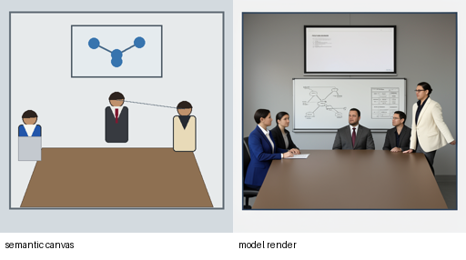

- Canvas: `Docs/evals/semantic_lab_v1/triad-vis-o2-2026-07-24/canvases/absent/broken.png`
- Canvas SHA-256: `eb6107e6bc22f3b38952c632048cd6b50e0f4f0fae811ba29a165f990c1fde24`
- Render: `images/absent/broken.png`
- Render SHA-256: `319daabbd0e2a6937e8d060a9d058f4aa33053e48a5a30076ae0b00ef1f32996`
- Execution: Call `6`; request `image_request_97000537ce7a5331cc6e133b2b9f92da`; call `render_call_b71ed98c9fd652814224c0244544c9a2`.

Human review (intentionally blank):

- Canvas matches intended semantics:
- Render follows canvas:
- Self identity stable:
- Colleague identity stable:
- Leader identity stable:
- Audience count correct:
- Camera/layout continuity correct:
- Transition mode respected:
- Self position correct:
- Attention/gaze correct:
- Obstacle state correct:
- Recognition state visible:
- Private scene truly private:
- No extra person:
- No duplicate person:
- No readable-text artifact:
- Unsupported generated detail:
- Prompt predetermines option:
- Usable for Racio vision:

### credit_no_response

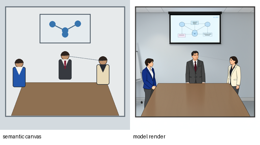

- Canvas: `Docs/evals/semantic_lab_v1/triad-vis-o2-2026-07-24/canvases/absent/credit_no_response.png`
- Canvas SHA-256: `0ae0fef92b819c405440cb4f43b52d3d292d6e96c4926f35d5ffa79d5e4b20f6`
- Render: `images/absent/current.png`
- Render SHA-256: `808ab354d6307534798f96b673a1e6ceac8388d80a914ad4e5b47c33a173bd8d`
- Execution: No model call; exact current image artifact alias.

Human review (intentionally blank):

- Canvas matches intended semantics:
- Render follows canvas:
- Self identity stable:
- Colleague identity stable:
- Leader identity stable:
- Audience count correct:
- Camera/layout continuity correct:
- Transition mode respected:
- Self position correct:
- Attention/gaze correct:
- Obstacle state correct:
- Recognition state visible:
- Private scene truly private:
- No extra person:
- No duplicate person:
- No readable-text artifact:
- Unsupported generated detail:
- Prompt predetermines option:
- Usable for Racio vision:

### credit_private_evidence

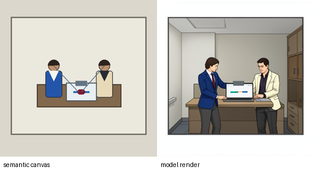

- Canvas: `Docs/evals/semantic_lab_v1/triad-vis-o2-2026-07-24/canvases/absent/credit_private_evidence.png`
- Canvas SHA-256: `44534c66f492be08fcbba52a192e2a4fc337def7c983f661df73c81e5eaa353e`
- Render: `images/absent/credit_private_evidence.png`
- Render SHA-256: `8b50cb86211b21df6afc2eae88c98c391ed93d37d4d386df33a80a818bd28bfb`
- Execution: Call `8`; request `image_request_d911ac5ab2c017f56f9969bc689d651c`; call `render_call_79e95f906953892200182c0494c832a1`.

Human review (intentionally blank):

- Canvas matches intended semantics:
- Render follows canvas:
- Self identity stable:
- Colleague identity stable:
- Leader identity stable:
- Audience count correct:
- Camera/layout continuity correct:
- Transition mode respected:
- Self position correct:
- Attention/gaze correct:
- Obstacle state correct:
- Recognition state visible:
- Private scene truly private:
- No extra person:
- No duplicate person:
- No readable-text artifact:
- Unsupported generated detail:
- Prompt predetermines option:
- Usable for Racio vision:

### credit_public_confront

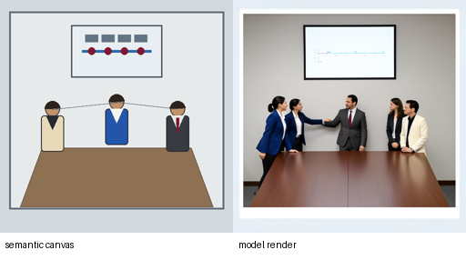

- Canvas: `Docs/evals/semantic_lab_v1/triad-vis-o2-2026-07-24/canvases/absent/credit_public_confront.png`
- Canvas SHA-256: `c5ea16f53dfe3db44e8754a47f2ef3e6f2f8fb2063382e3fb730b8f9d958e084`
- Render: `images/absent/credit_public_confront.png`
- Render SHA-256: `1eddcbb131370b16dac7422ef930e61a33492234e8275935264bbab9415baa84`
- Execution: Call `10`; request `image_request_58ef3815ceef22d5e2d226076af3a10a`; call `render_call_a92f80d0f8244e0c5ef26fc13da155b3`.

Human review (intentionally blank):

- Canvas matches intended semantics:
- Render follows canvas:
- Self identity stable:
- Colleague identity stable:
- Leader identity stable:
- Audience count correct:
- Camera/layout continuity correct:
- Transition mode respected:
- Self position correct:
- Attention/gaze correct:
- Obstacle state correct:
- Recognition state visible:
- Private scene truly private:
- No extra person:
- No duplicate person:
- No readable-text artifact:
- Unsupported generated detail:
- Prompt predetermines option:
- Usable for Racio vision:
